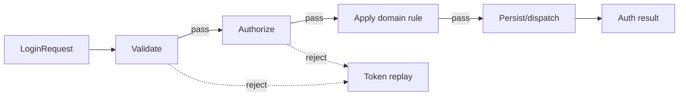

# Playground 68: Chain of Responsibility — Authentication

## Mục tiêu học tập

Chạy một ví dụ nhỏ về **xử lý use case authentication** và quan sát cách **Chain** giúp truyền request qua các handler có thể xử lý hoặc chuyển tiếp. Playground này là drill 10–15 phút; flagship playground phù hợp hơn cho luồng nhiều bước.

Sau bài này, người học phải giải thích được **request đi qua chuỗi handler** trong bối cảnh authentication, chỉ ra dependency đã bị đảo hoặc che giấu, và nêu trường hợp giải pháp trực tiếp vẫn tốt hơn.

## Bối cảnh và invariant

- **Nghiệp vụ:** credential verifier, identity và auth result.
- **Invariant:** credential không được log và quyết định auth phải nhất quán.
- **Change axis:** thêm/bỏ/reorder rule độc lập.
- **Failure bắt buộc quan sát:** provider unavailable, expired credential hoặc account locked; ở mức pattern cần chú ý thêm request bị rơi, xử lý hai lần hoặc thứ tự handler sai.



## Cách chạy

```bash
php playground/068-chain-authentication/index.php
```

Trước khi chạy, dự đoán output và ghi lại concrete detail mà client đang biết. Sau khi chạy, đối chiếu xem **mỗi handler quyết định xử lý hoặc chuyển tiếp** đã làm client biết ít đi điều gì, đồng thời kiểm tra invariant của authentication vẫn được giữ.

## Thử nghiệm có hướng dẫn

1. Chạy baseline và lưu output/error hiện tại.
2. Thử account locked và bảo đảm lỗi không rò thông tin nhạy cảm.
3. Tạo failure **provider unavailable, expired credential hoặc account locked** và yêu cầu lỗi được biểu diễn rõ, không silent fallback.
4. Viết test tập trung vào **credential không được log và quyết định auth phải nhất quán**.
5. Thử bỏ abstraction; nếu code trực tiếp vẫn rõ và change axis chưa tồn tại, ghi lại lý do chưa áp dụng Chain of Responsibility.

## Câu hỏi review

- Trong miền authentication, phần nào là policy/domain rule và phần nào chỉ là wiring?
- Chain of Responsibility bảo vệ thay đổi **thêm/bỏ/reorder rule độc lập** bằng cơ chế nào?
- Failure **provider unavailable, expired credential hoặc account locked** được phát hiện, dịch và quan sát ở boundary nào?
- Abstraction có làm invariant **credential không được log và quyết định auth phải nhất quán** dễ test hơn không?
- Complexity mới xuất hiện ở đâu: số class, ordering, lifecycle hay debugging?

## Kết quả mong đợi

Một lời giải đạt yêu cầu phải chứng minh flow authentication vẫn giữ invariant khi thay implementation chain, có assertion cho failure đã nêu và giải thích được trade-off của boundary mới. Không chấm điểm dựa trên số lượng interface hoặc class.
