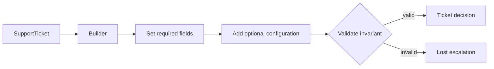

# Playground 80: Builder — Support

## Mục tiêu học tập

Chạy một ví dụ nhỏ về **phân loại ticket và định tuyến đội xử lý** và quan sát cách **Builder** giúp xây object phức tạp theo bước và kiểm tra invariant khi build. Playground này là drill 10–15 phút; flagship playground phù hợp hơn cho luồng nhiều bước.

Sau bài này, người học phải giải thích được **dựng object nhiều bước có invariant** trong bối cảnh support, chỉ ra dependency đã bị đảo hoặc che giấu, và nêu trường hợp giải pháp trực tiếp vẫn tốt hơn.

## Bối cảnh và invariant

- **Nghiệp vụ:** ticket category, SLA, escalation và assignment.
- **Invariant:** ticket không được mất owner, priority hoặc audit trail.
- **Change axis:** thêm representation/step tùy chọn.
- **Failure bắt buộc quan sát:** rule không match, escalation loop hoặc duplicate action; ở mức pattern cần chú ý thêm build object thiếu field bắt buộc hoặc state builder bị tái sử dụng sai.



## Cách chạy

```bash
php playground/080-builder-support/index.php
```

Trước khi chạy, dự đoán output và ghi lại concrete detail mà client đang biết. Sau khi chạy, đối chiếu xem **tách construction process khỏi representation** đã làm client biết ít đi điều gì, đồng thời kiểm tra invariant của support vẫn được giữ.

## Thử nghiệm có hướng dẫn

1. Chạy baseline và lưu output/error hiện tại.
2. Thử ticket vượt sla và kiểm tra escalation chỉ chạy một lần.
3. Tạo failure **rule không match, escalation loop hoặc duplicate action** và yêu cầu lỗi được biểu diễn rõ, không silent fallback.
4. Viết test tập trung vào **ticket không được mất owner, priority hoặc audit trail**.
5. Thử bỏ abstraction; nếu code trực tiếp vẫn rõ và change axis chưa tồn tại, ghi lại lý do chưa áp dụng Builder.

## Câu hỏi review

- Trong miền support, phần nào là policy/domain rule và phần nào chỉ là wiring?
- Builder bảo vệ thay đổi **thêm representation/step tùy chọn** bằng cơ chế nào?
- Failure **rule không match, escalation loop hoặc duplicate action** được phát hiện, dịch và quan sát ở boundary nào?
- Abstraction có làm invariant **ticket không được mất owner, priority hoặc audit trail** dễ test hơn không?
- Complexity mới xuất hiện ở đâu: số class, ordering, lifecycle hay debugging?

## Kết quả mong đợi

Một lời giải đạt yêu cầu phải chứng minh flow support vẫn giữ invariant khi thay implementation builder, có assertion cho failure đã nêu và giải thích được trade-off của boundary mới. Không chấm điểm dựa trên số lượng interface hoặc class.
