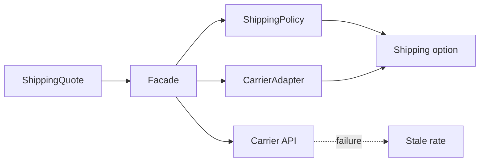

# Playground 83: Facade — Shipping

## Mục tiêu học tập

Chạy một ví dụ nhỏ về **tính phí và ETA theo vùng** và quan sát cách **Facade** giúp cung cấp API use-case đơn giản trước nhiều subsystem. Playground này là drill 10–15 phút; flagship playground phù hợp hơn cho luồng nhiều bước.

Sau bài này, người học phải giải thích được **đơn giản hóa orchestration nhiều subsystem** trong bối cảnh shipping, chỉ ra dependency đã bị đảo hoặc che giấu, và nêu trường hợp giải pháp trực tiếp vẫn tốt hơn.

## Bối cảnh và invariant

- **Nghiệp vụ:** carrier, zone, weight và promised date.
- **Invariant:** phí và SLA phải nhất quán với tuyến giao hàng.
- **Change axis:** thay subsystem mà client không đổi.
- **Failure bắt buộc quan sát:** carrier timeout hoặc bảng giá không tồn tại; ở mức pattern cần chú ý thêm facade trở thành god service hoặc che giấu transaction lỗi.



## Cách chạy

```bash
php playground/083-facade-shipping/index.php
```

Trước khi chạy, dự đoán output và ghi lại concrete detail mà client đang biết. Sau khi chạy, đối chiếu xem **cung cấp entry point theo use case** đã làm client biết ít đi điều gì, đồng thời kiểm tra invariant của shipping vẫn được giữ.

## Thử nghiệm có hướng dẫn

1. Chạy baseline và lưu output/error hiện tại.
2. Thêm carrier mới và kiểm tra fallback không làm sai sla.
3. Tạo failure **carrier timeout hoặc bảng giá không tồn tại** và yêu cầu lỗi được biểu diễn rõ, không silent fallback.
4. Viết test tập trung vào **phí và SLA phải nhất quán với tuyến giao hàng**.
5. Thử bỏ abstraction; nếu code trực tiếp vẫn rõ và change axis chưa tồn tại, ghi lại lý do chưa áp dụng Facade.

## Câu hỏi review

- Trong miền shipping, phần nào là policy/domain rule và phần nào chỉ là wiring?
- Facade bảo vệ thay đổi **thay subsystem mà client không đổi** bằng cơ chế nào?
- Failure **carrier timeout hoặc bảng giá không tồn tại** được phát hiện, dịch và quan sát ở boundary nào?
- Abstraction có làm invariant **phí và SLA phải nhất quán với tuyến giao hàng** dễ test hơn không?
- Complexity mới xuất hiện ở đâu: số class, ordering, lifecycle hay debugging?

## Kết quả mong đợi

Một lời giải đạt yêu cầu phải chứng minh flow shipping vẫn giữ invariant khi thay implementation facade, có assertion cho failure đã nêu và giải thích được trade-off của boundary mới. Không chấm điểm dựa trên số lượng interface hoặc class.
