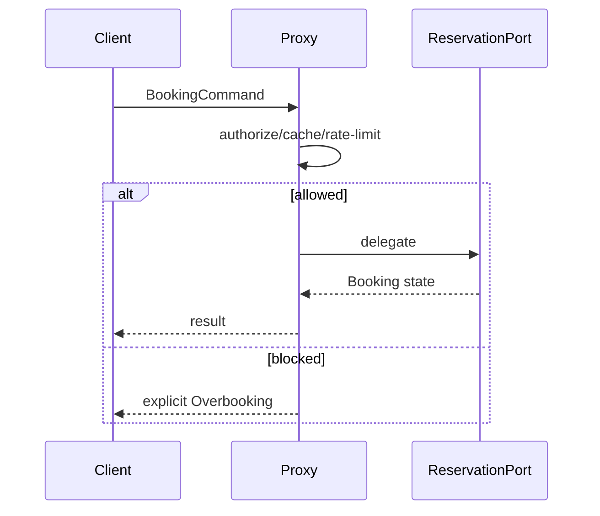

# Playground 99: Proxy — Booking

## Mục tiêu học tập

Quan sát Proxy trong miền booking.

Sau bài này, người học phải giải thích được **kiểm soát truy cập vào object thật** trong bối cảnh booking, chỉ ra dependency đã bị đảo hoặc che giấu, và nêu trường hợp giải pháp trực tiếp vẫn tốt hơn.

## Bối cảnh và invariant

- **Nghiệp vụ:** availability interval, hold TTL và confirmation.
- **Invariant:** một resource không thể được xác nhận trùng thời gian.
- **Change axis:** thêm access policy mà giữ interface.
- **Failure bắt buộc quan sát:** hold hết hạn, overlap hoặc payment/confirmation lệch trạng thái; ở mức pattern cần chú ý thêm proxy thay đổi semantics, cache stale hoặc bypass authorization.



## Cách chạy

```bash
php playground/099-proxy-booking/index.php
```

Trước khi chạy, dự đoán output và ghi lại concrete detail mà client đang biết. Sau khi chạy, đối chiếu xem **intercept authorization, cache hoặc lazy loading** đã làm client biết ít đi điều gì, đồng thời kiểm tra invariant của booking vẫn được giữ.

## Thử nghiệm có hướng dẫn

1. Chạy baseline và lưu output/error hiện tại.
2. Tạo hai request cạnh tranh và kiểm tra chỉ một booking được xác nhận.
3. Tạo failure **hold hết hạn, overlap hoặc payment/confirmation lệch trạng thái** và yêu cầu lỗi được biểu diễn rõ, không silent fallback.
4. Viết test tập trung vào **một resource không thể được xác nhận trùng thời gian**.
5. Thử bỏ abstraction; nếu code trực tiếp vẫn rõ và change axis chưa tồn tại, ghi lại lý do chưa áp dụng Proxy.

## Câu hỏi review

- Trong miền booking, phần nào là policy/domain rule và phần nào chỉ là wiring?
- Proxy bảo vệ thay đổi **thêm access policy mà giữ interface** bằng cơ chế nào?
- Failure **hold hết hạn, overlap hoặc payment/confirmation lệch trạng thái** được phát hiện, dịch và quan sát ở boundary nào?
- Abstraction có làm invariant **một resource không thể được xác nhận trùng thời gian** dễ test hơn không?
- Complexity mới xuất hiện ở đâu: số class, ordering, lifecycle hay debugging?

## Kết quả mong đợi

Một lời giải đạt yêu cầu phải chứng minh flow booking vẫn giữ invariant khi thay implementation proxy, có assertion cho failure đã nêu và giải thích được trade-off của boundary mới. Không chấm điểm dựa trên số lượng interface hoặc class.
