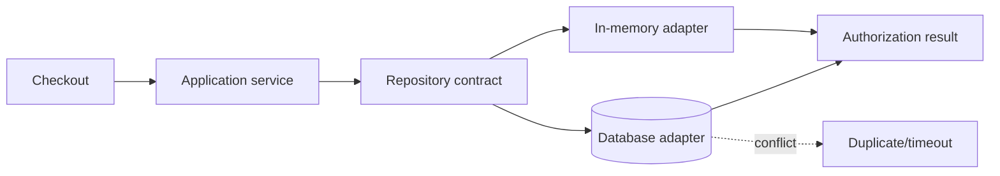

# Playground 100: Repository — Payment

## Mục tiêu học tập

Chạy một ví dụ nhỏ về **chọn gateway cho authorize/capture/refund** và quan sát cách **Repository** giúp che persistence cho aggregate. Playground này là drill 10–15 phút; flagship playground phù hợp hơn cho luồng nhiều bước.

Sau bài này, người học phải giải thích được **domain thao tác collection thay vì persistence API** trong bối cảnh payment, chỉ ra dependency đã bị đảo hoặc che giấu, và nêu trường hợp giải pháp trực tiếp vẫn tốt hơn.

## Bối cảnh và invariant

- **Nghiệp vụ:** authorize, capture, refund và idempotency key.
- **Invariant:** một giao dịch không được capture/refund lặp.
- **Change axis:** thay storage hoặc query implementation.
- **Failure bắt buộc quan sát:** duplicate charge, timeout sau provider success; ở mức pattern cần chú ý thêm repository thành wrapper CRUD, tenant filter bị bỏ sót.



## Cách chạy

```bash
php playground/100-repository-payment/index.php
```

Trước khi chạy, dự đoán output và ghi lại concrete detail mà client đang biết. Sau khi chạy, đối chiếu xem **che persistence và diễn đạt query theo domain** đã làm client biết ít đi điều gì, đồng thời kiểm tra invariant của payment vẫn được giữ.

## Thử nghiệm có hướng dẫn

1. Chạy baseline và lưu output/error hiện tại.
2. Dùng cùng idempotency key với payload khác và kiểm tra conflict.
3. Tạo failure **duplicate charge, timeout sau provider success** và yêu cầu lỗi được biểu diễn rõ, không silent fallback.
4. Viết test tập trung vào **một giao dịch không được capture/refund lặp**.
5. Thử bỏ abstraction; nếu code trực tiếp vẫn rõ và change axis chưa tồn tại, ghi lại lý do chưa áp dụng Repository.

## Câu hỏi review

- Trong miền payment, phần nào là policy/domain rule và phần nào chỉ là wiring?
- Repository bảo vệ thay đổi **thay storage hoặc query implementation** bằng cơ chế nào?
- Failure **duplicate charge, timeout sau provider success** được phát hiện, dịch và quan sát ở boundary nào?
- Abstraction có làm invariant **một giao dịch không được capture/refund lặp** dễ test hơn không?
- Complexity mới xuất hiện ở đâu: số class, ordering, lifecycle hay debugging?

## Kết quả mong đợi

Một lời giải đạt yêu cầu phải chứng minh flow payment vẫn giữ invariant khi thay implementation repository, có assertion cho failure đã nêu và giải thích được trade-off của boundary mới. Không chấm điểm dựa trên số lượng interface hoặc class.
