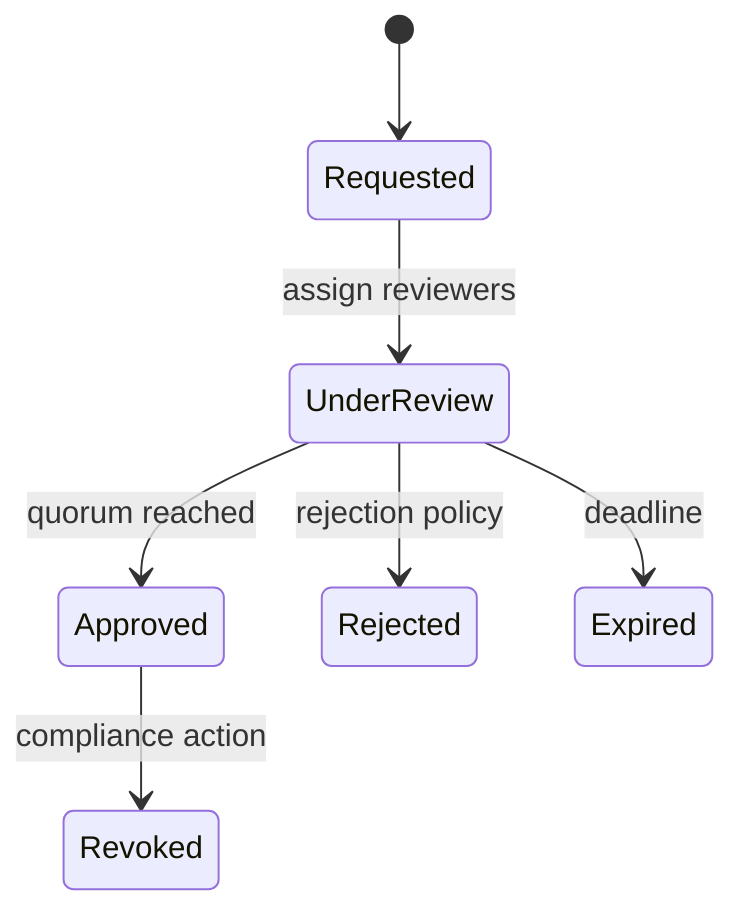

# Approval Workflow

## Bài toán mô phỏng

Mini-application này mô phỏng luồng **request → evaluate → approve/reject → audit**. Mục tiêu là quan sát một use case nhỏ nhưng có boundary, invariant và failure path đủ rõ để thảo luận như code production.

## Invariant và failure quan trọng

- **Invariant:** Người tạo request không tự approve khi policy cấm.
- **Failure cần tái hiện:** Concurrent approvals và policy thay đổi.

## Luồng thiết kế



## Chạy

```bash
php playground/flagship/approval-workflow/index.php
php playground/flagship/approval-workflow/test.php
```

## Kịch bản thực hành

1. Cho requester tự approve khi policy cấm.
2. Hai reviewer approve đồng thời.
3. Thay policy giữa phiên review và kiểm tra version.

## Câu hỏi review

- Quorum, role và separation-of-duty được biểu diễn thế nào?
- Approval sau deadline hoặc sau revoke bị từ chối ra sao?
- Audit log có đủ actor, reason và policy version không?
- Baseline đơn giản hơn nào vẫn đủ cho **approval workflow** nếu bỏ yêu cầu phân tán?

## Mở rộng

Thay `ApprovalPolicy` in-memory bằng policy có giới hạn phê duyệt theo vai trò. Mô phỏng stale approval và xác nhận transition bị từ chối mà không tạo audit event sai.

## Kịch bản enterprise bắt buộc

Mini-application **Approval Workflow** phải cho phép quan sát: illegal transition, escalation timeout và audit trail.

## Expected output

In request version, current approver, transition và escalation deadline; audit actor/reason.

## Bài tập nâng cấp

Mô phỏng approve-vs-cancel; thêm timeout escalation; test separation-of-duties.

## Tiêu chí hoàn thành

Đạt khi transition hợp lệ, actor unauthorized bị chặn và audit trail đủ tái dựng quyết định.

## Quan sát khi chạy

In ra request id, policy version, handler đã đánh giá và reason code. Thử đổi thứ tự rule để thấy Chain khác Pipeline: handler có thể kết thúc sớm khi đã có quyết định. Thêm một rule lỗi tạm thời và quyết định rõ workflow sẽ retry, chuyển manual review hay từ chối an toàn.
