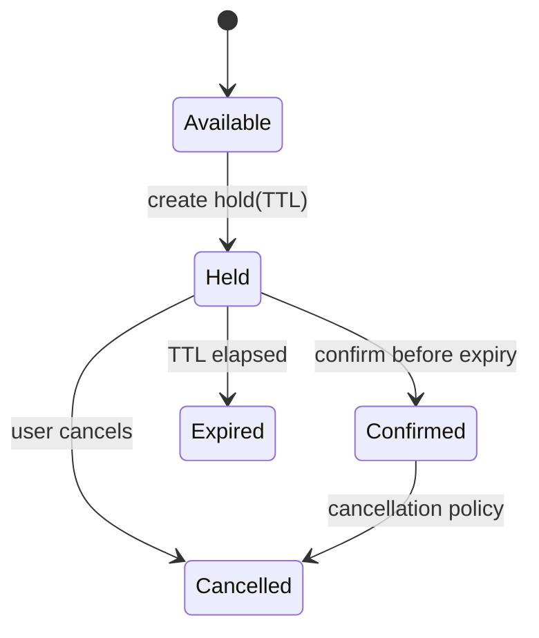

# Booking Console

## Bài toán mô phỏng

Mini-application này mô phỏng luồng **search → hold → confirm/cancel**. Mục tiêu là quan sát một use case nhỏ nhưng có boundary, invariant và failure path đủ rõ để thảo luận như code production.

## Invariant và failure quan trọng

- **Invariant:** Hai booking confirmed không được overlap cùng resource.
- **Failure cần tái hiện:** Hold hết hạn trong lúc confirm.

## Luồng thiết kế



## Chạy

```bash
php playground/flagship/booking-console/index.php
php playground/flagship/booking-console/test.php
```

## Kịch bản thực hành

1. Tạo hai khoảng thời gian overlap.
2. Confirm đúng lúc TTL hết hạn.
3. Kiểm tra cancellation policy sau confirmed.

## Câu hỏi review

- Interval semantics là [start,end) hay inclusive?
- Hold TTL và confirmation race được xử lý bằng token/version nào?
- Cancellation có kích hoạt waitlist một cách idempotent không?
- Baseline đơn giản hơn nào vẫn đủ cho **booking console** nếu bỏ yêu cầu phân tán?

## Mở rộng

Thay kho availability bằng fake trả về conflict sau khi hold được tạo. Quan sát compensation giải phóng hold và correlation ID nối liền toàn bộ luồng.

## Kịch bản enterprise bắt buộc

Mini-application **Booking Console** phải cho phép quan sát: overlap, hold expiry và waitlist activation.

## Expected output

In resource, interval, hold token, version và waitlist action; hiển thị overlap decision.

## Bài tập nâng cấp

Mô phỏng DST/overlap; thêm hold TTL; test confirm/cancel race và waitlist promotion.

## Tiêu chí hoàn thành

Đạt khi interval semantics rõ, capacity không âm và cancellation kích hoạt đúng candidate.

## Quan sát khi chạy

Ghi interval chuẩn hóa, hold token, expiry instant và version tại mỗi transition. Chạy confirm đúng sát thời điểm hết hạn bằng clock giả để kết quả lặp lại. Khi cancellation giải phóng slot, in candidate waitlist được chọn và lý do, giúp người học thấy state machine liên kết với capacity projection.

## Runtime evidence nên quan sát

In resource, interval chuẩn hóa, hold token, expiry và version. Kiểm tra hai interval chạm biên không overlap theo convention đã chọn; DST/timezone được chuyển sang UTC trước khi so sánh. Confirm sau expiry phải trả domain outcome rõ ràng và không chiếm capacity.
