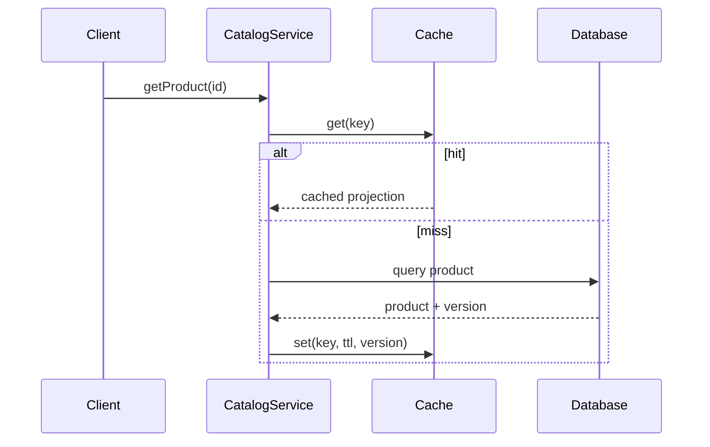

# Cache-aside Catalog

## Bài toán mô phỏng

Mini-application này mô phỏng luồng **read cache → load source → populate**. Mục tiêu là quan sát một use case nhỏ nhưng có boundary, invariant và failure path đủ rõ để thảo luận như code production.

## Invariant và failure quan trọng

- **Invariant:** Cache không được trở thành source of truth.
- **Failure cần tái hiện:** Stampede, stale data và invalidation miss.

## Luồng thiết kế



## Chạy

```bash
php playground/flagship/cache-aside-catalog/index.php
php playground/flagship/cache-aside-catalog/test.php
```

## Kịch bản thực hành

1. Tạo cache miss đồng thời để quan sát stampede.
2. Cập nhật DB nhưng bỏ invalidation.
3. Thêm version check để không ghi đè dữ liệu mới bằng response cũ.

## Câu hỏi review

- Source of truth và freshness budget là gì?
- Stampede được chặn bằng lock/single-flight hay probabilistic refresh?
- Invalidation failure được phát hiện bằng version/age metric nào?
- Baseline đơn giản hơn nào vẫn đủ cho **cache aside catalog** nếu bỏ yêu cầu phân tán?

## Mở rộng

Dùng fake clock để làm entry hết TTL giữa hai lần đọc. Xác nhận cache miss quay về source of truth và không trả dữ liệu stale ngoài freshness budget.

## Kịch bản enterprise bắt buộc

Mini-application **Cache-aside Catalog** phải cho phép quan sát: stale cache, stampede và source-of-truth recovery.

## Expected output

In cache key/version, hit/miss, source read và invalidation event.

## Bài tập nâng cấp

Mô phỏng stampede; thêm single-flight/TTL jitter; test stale entry sau update.

## Tiêu chí hoàn thành

Đạt khi source of truth luôn thắng, stampede được giới hạn và stale window có SLO rõ.

## Quan sát khi chạy

Hiển thị cache key version, hit/miss, source latency và age của entry. Mô phỏng source cập nhật nhưng cache chưa invalidate để thảo luận stale tolerance. Sau đó đổi serializer version và chứng minh key namespace mới tránh đọc object cũ không tương thích.
