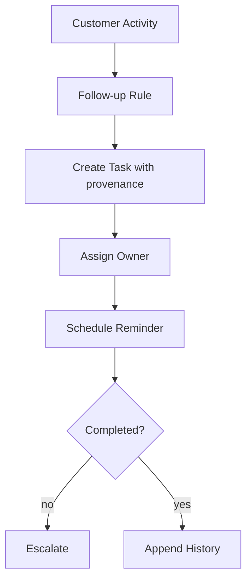

# CRM Follow-up

## Bài toán mô phỏng

Mini-application này mô phỏng luồng **record activity → schedule → assign**. Mục tiêu là quan sát một use case nhỏ nhưng có boundary, invariant và failure path đủ rõ để thảo luận như code production.

## Invariant và failure quan trọng

- **Invariant:** Mỗi follow-up có owner, due date và provenance.
- **Failure cần tái hiện:** Lead merge hoặc reassignment làm mất task.

## Luồng thiết kế



## Chạy

```bash
php playground/flagship/crm-follow-up/index.php
php playground/flagship/crm-follow-up/test.php
```

## Kịch bản thực hành

1. Merge hai lead có task đang mở.
2. Reassign owner và bảo toàn provenance.
3. Kiểm tra reminder không gửi cho task completed.

## Câu hỏi review

- Consent và contact preference được kiểm tra trước task creation ở đâu?
- Duplicate lead/contact được resolve bằng identity key nào?
- Assignment retry có tạo hai follow-up không?
- Baseline đơn giản hơn nào vẫn đủ cho **crm follow up** nếu bỏ yêu cầu phân tán?

## Mở rộng

Mô phỏng CRM provider timeout sau khi đã tạo activity. Dùng operation ID để retry không tạo follow-up trùng và kiểm tra audit trail giữ provider reference.

## Kịch bản enterprise bắt buộc

Mini-application **CRM Follow-up** phải cho phép quan sát: duplicate identity, consent và follow-up scheduling.

## Expected output

In customer identity, consent version, owner và next-action time; merge phải giữ provenance.

## Bài tập nâng cấp

Tạo duplicate contact; thêm merge/split audit; test opt-out ngăn mọi follow-up channel.

## Tiêu chí hoàn thành

Đạt khi identity resolution reversible, consent được tôn trọng và scheduler không tạo action trùng.

## Quan sát khi chạy

In customer identity resolution, consent snapshot, owner và next-action timestamp. Thử merge hai hồ sơ có consent khác nhau; hệ thống phải giữ provenance thay vì chọn ngẫu nhiên. Follow-up bị chặn khi consent không hợp lệ cần xuất reason code để sales và compliance cùng hiểu.
