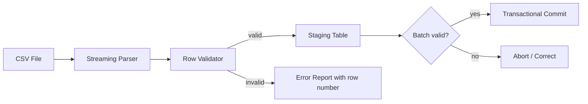

# CSV Importer

## Bài toán mô phỏng

Mini-application này mô phỏng luồng **parse → validate → stage → commit**. Mục tiêu là quan sát một use case nhỏ nhưng có boundary, invariant và failure path đủ rõ để thảo luận như code production.

## Invariant và failure quan trọng

- **Invariant:** Dòng lỗi không làm mất khả năng truy vết hoặc commit nhầm batch.
- **Failure cần tái hiện:** File lớn, malformed row và partial failure.

## Luồng thiết kế



## Chạy

```bash
php playground/flagship/csv-importer/index.php
php playground/flagship/csv-importer/test.php
```

## Kịch bản thực hành

1. Chèn malformed row giữa file lớn.
2. Giả lập commit batch thứ hai lỗi.
3. Đối chiếu error report với row number gốc.

## Câu hỏi review

- Row identity và restart checkpoint được xác định ra sao?
- Validation error được gom theo row mà không dừng toàn batch thế nào?
- Import replay có tạo duplicate entity không?
- Baseline đơn giản hơn nào vẫn đủ cho **csv importer** nếu bỏ yêu cầu phân tán?

## Mở rộng

Thay parser bằng fake phát sinh lỗi ở dòng giữa batch. Xác nhận lỗi được ghi theo row, các dòng hợp lệ vẫn có kết quả xác định và resume không import trùng.

## Kịch bản enterprise bắt buộc

Mini-application **CSV Importer** phải cho phép quan sát: invalid row, partial batch và resumable import.

## Expected output

In batch id, row number, validation result, checkpoint và error summary.

## Bài tập nâng cấp

Tạo file lỗi giữa batch; thêm resumable checkpoint; test retry không insert duplicate.

## Tiêu chí hoàn thành

Đạt khi partial failure có report, restart từ checkpoint và memory không tăng theo toàn file.

## Quan sát khi chạy

Mỗi row phải có row number, normalized key, validation errors và import operation id. Chạy lại cùng file để kiểm tra idempotency. Thêm lỗi ở giữa batch và xác định rõ atomic toàn file, atomic theo row hay chunk transaction; output phải phản ánh đúng policy đã chọn.
