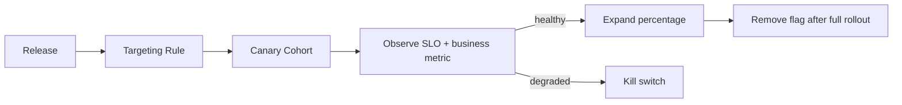

# Feature Flag Rollout

## Bài toán mô phỏng

Mini-application này mô phỏng luồng **target → canary → observe → expand/rollback**. Mục tiêu là quan sát một use case nhỏ nhưng có boundary, invariant và failure path đủ rõ để thảo luận như code production.

## Invariant và failure quan trọng

- **Invariant:** Cùng một subject nhận quyết định ổn định trong rollout.
- **Failure cần tái hiện:** Metric xấu hoặc config propagation chậm.

## Luồng thiết kế



## Chạy

```bash
php playground/flagship/feature-flag-rollout/index.php
php playground/flagship/feature-flag-rollout/test.php
```

## Kịch bản thực hành

1. Giữ cùng subject qua nhiều lần evaluate.
2. Làm metric canary vượt ngưỡng để kích hoạt kill switch.
3. Kiểm tra cleanup flag sau full rollout.

## Câu hỏi review

- Cohort assignment ổn định và deterministic theo key nào?
- Kill switch bypass cache trong bao lâu?
- Metric guardrail nào tự động rollback rollout?
- Baseline đơn giản hơn nào vẫn đủ cho **feature flag rollout** nếu bỏ yêu cầu phân tán?

## Mở rộng

Mô phỏng flag provider không khả dụng. Kiểm tra fallback an toàn, cohort assignment ổn định và metric phân biệt lỗi provider với business outcome.

## Kịch bản enterprise bắt buộc

Mini-application **Feature Flag Rollout** phải cho phép quan sát: cohort mismatch, kill switch và stale config.

## Expected output

In flag version, cohort decision, evaluation reason và kill-switch state.

## Bài tập nâng cấp

Thêm deterministic bucketing; test stale config; mô phỏng metric regression kích hoạt rollback.

## Tiêu chí hoàn thành

Đạt khi cùng user có quyết định ổn định, kill switch ưu tiên và rollout có evidence theo cohort.

## Quan sát khi chạy

In flag version, cohort assignment, selected implementation và comparison result. Thử thay percentage rollout nhưng giữ assignment ổn định theo user key. Khi mismatch vượt threshold, kill switch phải chuyển về baseline ngay mà không deploy, đồng thời giữ log đủ để phân tích input gây lệch.
