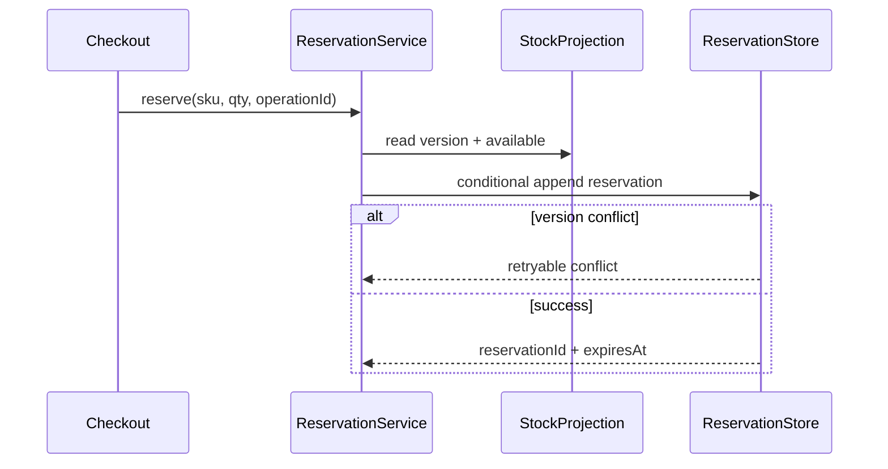

# Inventory Reservation

## Bài toán mô phỏng

Mini-application này mô phỏng luồng **check ATP → reserve → expire/release**. Mục tiêu là quan sát một use case nhỏ nhưng có boundary, invariant và failure path đủ rõ để thảo luận như code production.

## Invariant và failure quan trọng

- **Invariant:** available = on_hand - active_reservations không âm.
- **Failure cần tái hiện:** Concurrent reservation và expired hold.

## Luồng thiết kế



## Chạy

```bash
php playground/flagship/inventory-reservation/index.php
php playground/flagship/inventory-reservation/test.php
```

## Kịch bản thực hành

1. Gửi hai reservation cạnh tranh cùng version.
2. Expire hold rồi thử confirm.
3. Kiểm tra tổng available + active reservation không vượt on-hand.

## Câu hỏi review

- Operation ID và aggregate version ngăn oversell thế nào?
- Reservation expiry có tạo ledger entry/reconciliation không?
- Contention cao chuyển sang serialized queue khi nào?
- Baseline đơn giản hơn nào vẫn đủ cho **inventory reservation** nếu bỏ yêu cầu phân tán?

## Mở rộng

Mô phỏng hai reservation cùng đọc một version tồn kho. Xác nhận chỉ một conditional write thành công và request còn lại nhận conflict có thể retry.

## Kịch bản enterprise bắt buộc

Mini-application **Inventory Reservation** phải cho phép quan sát: concurrent reservation, expiration và stock conservation.

## Expected output

In SKU, reservation id, quantity delta, expiry và available-to-promise trước/sau.

## Bài tập nâng cấp

Chạy hai reserve đồng thời; thêm optimistic version; property test tổng on-hand = available + reserved.

## Tiêu chí hoàn thành

Đạt khi không oversell, expiry giải phóng đúng một lần và ledger truy vết mọi thay đổi.

## Quan sát khi chạy

In on-hand, reserved, available và ledger position sau mỗi command. Chạy hai reserve cạnh tranh và xác nhận tổng available không âm. Mô phỏng reservation hết hạn nhưng release event đến hai lần; operation id phải ngăn cộng trả stock hai lần.

## Runtime evidence nên quan sát

- `reservation_version` tăng đúng một lần cho mỗi state change.
- `available_to_promise` không âm sau concurrent command.
- `release` lặp lại không cộng trả stock lần hai.
- Expiration job ghi lý do, operation ID và reservation age.

Khi mở rộng sang database, thay in-memory conditional check bằng optimistic update hoặc atomic statement và giữ nguyên contract conflict/retryable outcome.
