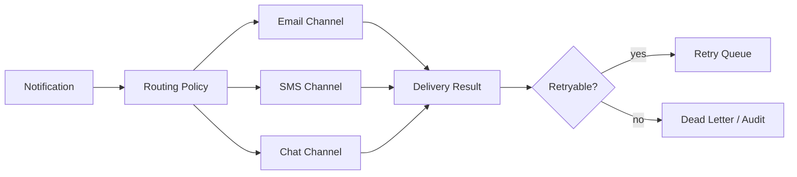

# Notification Router

## Bài toán mô phỏng

Mini-application này mô phỏng luồng **classify → route → send**. Mục tiêu là quan sát một use case nhỏ nhưng có boundary, invariant và failure path đủ rõ để thảo luận như code production.

## Invariant và failure quan trọng

- **Invariant:** Một notification chỉ chọn channel hợp lệ theo policy.
- **Failure cần tái hiện:** Temporary provider failure và permanent rejection.

## Luồng thiết kế



## Chạy

```bash
php playground/flagship/notification-router/index.php
php playground/flagship/notification-router/test.php
```

## Kịch bản thực hành

1. Đánh dấu email provider lỗi tạm thời và SMS lỗi vĩnh viễn.
2. Kiểm tra routing policy không gửi hai channel ngoài ý muốn.
3. Thêm DLQ assertion cho permanent failure.

## Câu hỏi review

- Preference, channel capability và provider health được ưu tiên theo thứ tự nào?
- Duplicate delivery được nhận diện theo notification ID hay provider message ID?
- Fallback có vi phạm user preference/quiet hours không?
- Baseline đơn giản hơn nào vẫn đủ cho **notification router** nếu bỏ yêu cầu phân tán?

## Mở rộng

Cho provider trả timeout sau khi accept request. Xác nhận idempotency key, retry classification và delivery log không tạo hai notification logic.

## Kịch bản enterprise bắt buộc

Mini-application **Notification Router** phải cho phép quan sát: provider outage, fallback channel và duplicate delivery.

## Expected output

In message id, selected channel, provider result và fallback reason; phân biệt accepted với delivered.

## Bài tập nâng cấp

Mô phỏng provider outage; thêm channel capability matrix; test fallback không gửi trùng khi provider primary trả late success.

## Tiêu chí hoàn thành

Đạt khi routing deterministic, retry chỉ áp dụng lỗi transient và delivery status có thể truy vết.

## Quan sát khi chạy

In template version, channel decision, provider request id và failure class. Timeout sau provider success phải đi vào reconciliation thay vì fallback ngay sang channel khác. Thử permanent rejection để thấy retry budget không bị tiêu tốn vô ích.
