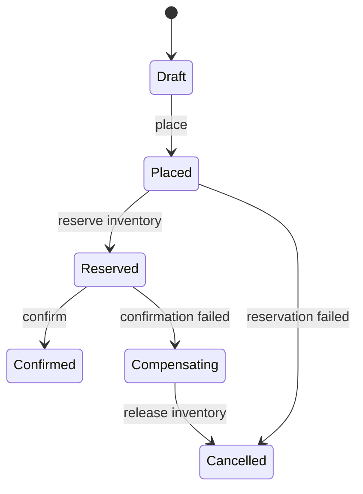

# Order Workflow

## Bài toán mô phỏng

Mini-application này mô phỏng luồng **place → reserve → confirm**. Mục tiêu là quan sát một use case nhỏ nhưng có boundary, invariant và failure path đủ rõ để thảo luận như code production.

## Invariant và failure quan trọng

- **Invariant:** Order không được confirm nếu reservation chưa thành công.
- **Failure cần tái hiện:** Reservation thành công nhưng confirm bị gián đoạn.

## Luồng thiết kế



## Chạy

```bash
php playground/flagship/order-workflow/index.php
php playground/flagship/order-workflow/test.php
```

## Kịch bản thực hành

1. Làm reservation thất bại và xác nhận order không chuyển Confirmed.
2. Giả lập confirm lỗi sau reserve để kiểm tra compensation.
3. Thêm stale-version test cho transition đồng thời.

## Câu hỏi review

- Transition nào là illegal và ai sở hữu transition authority?
- Allocation/fulfillment failure tạo compensation nào?
- Stuck order age được đo và resume ra sao?
- Baseline đơn giản hơn nào vẫn đủ cho **order workflow** nếu bỏ yêu cầu phân tán?

## Mở rộng

Inject lỗi payment capture sau khi stock đã reserve. Quan sát process manager phát compensation đúng thứ tự và không chuyển order sang trạng thái hoàn tất.

## Kịch bản enterprise bắt buộc

Mini-application **Order Workflow** phải cho phép quan sát: partial fulfillment, cancellation race và compensation.

## Expected output

In order version, state transition, allocation/fulfillment status và compensation command.

## Bài tập nâng cấp

Tạo race cancel-vs-ship; thêm process manager state; test partial fulfillment không hoàn inventory sai.

## Tiêu chí hoàn thành

Đạt khi illegal transition bị chặn, compensation idempotent và stuck workflow có metric/runbook.

## Quan sát khi chạy

In order state, process-manager step, command id và last event position. Gây timeout ở payment rồi phát success muộn để kiểm tra race với compensation. Workflow phải chọn một outcome nhất quán và lưu evidence cho manual investigation.

## Runtime evidence nên quan sát

Theo dõi workflow state, event offset và command operation ID trên cùng correlation ID. Mô phỏng event fulfillment đến trước payment confirmation; process manager phải giữ hoặc từ chối event theo rule thay vì cập nhật state tùy ý. Một order kẹt phải có age metric và thao tác recovery xác định bước tiếp theo.
