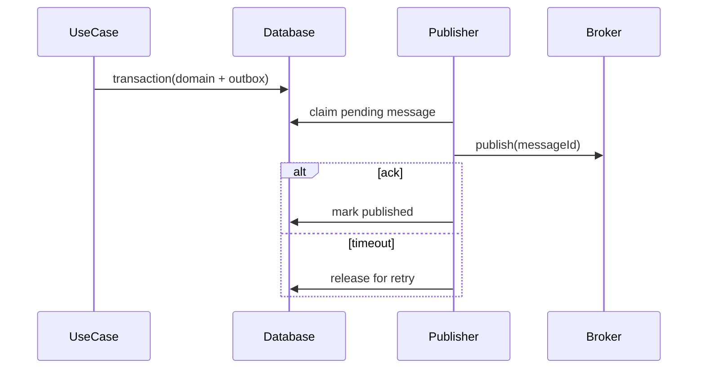

# Outbox Publisher

## Bài toán mô phỏng

Mini-application này mô phỏng luồng **commit domain change + outbox → publish → mark**. Mục tiêu là quan sát một use case nhỏ nhưng có boundary, invariant và failure path đủ rõ để thảo luận như code production.

## Invariant và failure quan trọng

- **Invariant:** Domain change và outbox record phải commit atomically.
- **Failure cần tái hiện:** Broker timeout sau publish gây duplicate delivery.

## Luồng thiết kế



## Chạy

```bash
php playground/flagship/outbox-publisher/index.php
php playground/flagship/outbox-publisher/test.php
```

## Kịch bản thực hành

1. Giả lập broker timeout sau khi nhận message.
2. Chạy publisher hai lần và kiểm tra consumer idempotency.
3. Kiểm tra claim timeout trả message về pending.

## Câu hỏi review

- Claim/lease ngăn hai publisher xử lý cùng message thế nào?
- Publish success nhưng mark failed được reconcile ra sao?
- Ordering theo aggregate có được bảo toàn không?
- Baseline đơn giản hơn nào vẫn đủ cho **outbox publisher** nếu bỏ yêu cầu phân tán?

## Mở rộng

Mô phỏng crash sau broker ack nhưng trước `markPublished`. Chạy lại publisher và xác nhận consumer inbox loại duplicate bằng event ID.

## Kịch bản enterprise bắt buộc

Mini-application **Outbox Publisher** phải cho phép quan sát: duplicate publish, backlog và poison message.

## Expected output

In outbox id, aggregate version, attempt count và publish state; duplicate publish phải thấy được.

## Bài tập nâng cấp

Mô phỏng crash sau broker ack; thêm lease/lock; test poison message sang dead-letter.

## Tiêu chí hoàn thành

Đạt khi state+outbox atomic, consumer idempotent và backlog có alert/replay tool.

## Quan sát khi chạy

In outbox id, aggregate id, attempt count và published timestamp. Mô phỏng publish success nhưng update trạng thái thất bại; lần sau sẽ gửi lại. Consumer test phải dùng event id để deduplicate và metric phải cho thấy oldest pending age tăng khi publisher dừng.

## Runtime evidence nên quan sát

In outbox ID, aggregate ID, attempt count, broker message ID và thời điểm `published_at`. Mô phỏng crash sau broker acknowledgement để thấy publish lặp; consumer deduplication phải giữ side effect đúng một lần về mặt nghiệp vụ. Theo dõi oldest pending age thay vì chỉ đếm số row.
