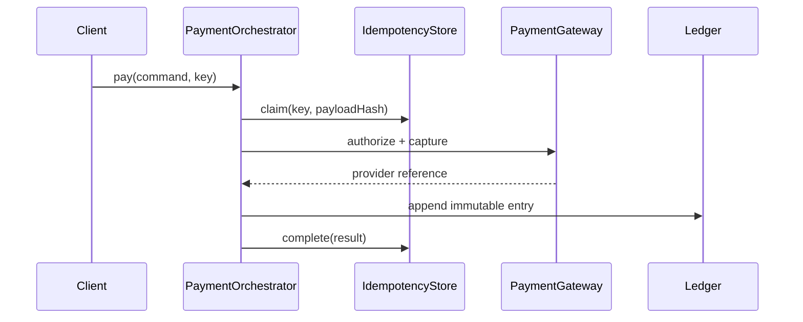

# Payment Orchestrator

## Bài toán mô phỏng

Mini-application này mô phỏng luồng **authorize → capture → record**. Mục tiêu là quan sát một use case nhỏ nhưng có boundary, invariant và failure path đủ rõ để thảo luận như code production.

## Invariant và failure quan trọng

- **Invariant:** Không được capture hai lần cho cùng idempotency key.
- **Failure cần tái hiện:** Provider timeout sau authorize.

## Luồng thiết kế



## Chạy

```bash
php playground/flagship/payment-orchestrator/index.php
php playground/flagship/payment-orchestrator/test.php
```

## Kịch bản thực hành

1. Replay cùng idempotency key nhưng payload khác và xác nhận bị từ chối.
2. Giả lập timeout sau provider success; kiểm tra reconciliation path.
3. Thêm assertion ledger không mất cân bằng.

## Câu hỏi review

- Idempotency record chuyển từ claimed sang completed ở thời điểm nào?
- Timeout sau provider success được reconcile bằng provider reference nào?
- Ledger append và payment state có cùng transaction/evidence ra sao?
- Baseline đơn giản hơn nào vẫn đủ cho **payment orchestrator** nếu bỏ yêu cầu phân tán?

## Mở rộng

Mô phỏng gateway timeout sau authorization. Dùng idempotency record và reconciliation để phân biệt unknown result với failed payment.

## Kịch bản enterprise bắt buộc

Mini-application **Payment Orchestrator** phải cho phép quan sát: timeout sau provider success, duplicate request và reconciliation.

## Expected output

In operation id, provider request id, payment state và reconciliation status; timeout phải cho thấy payment chưa chắc thất bại.

## Bài tập nâng cấp

Thêm provider simulator có success-then-timeout; viết invariant test “một operation chỉ có một charge”; tạo dashboard pending reconciliation.

## Tiêu chí hoàn thành

Đạt khi duplicate request trả cùng result, payload conflict bị từ chối và timeout có recovery không charge lại.

## Quan sát khi chạy

In idempotency key, gateway selection, provider reference và payment state. Mô phỏng timeout sau charge thành công, sau đó gọi lại cùng command. Orchestrator phải tra/reconcile thay vì charge lần hai; refund command cũng cần idempotency độc lập.
