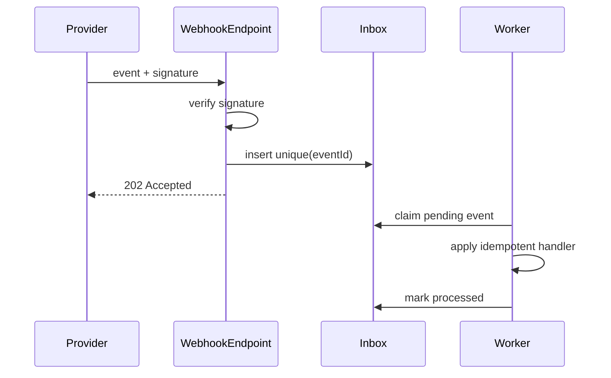

# Webhook Receiver

## Bài toán mô phỏng

Mini-application này mô phỏng luồng **verify → deduplicate → process**. Mục tiêu là quan sát một use case nhỏ nhưng có boundary, invariant và failure path đủ rõ để thảo luận như code production.

## Invariant và failure quan trọng

- **Invariant:** Một provider event chỉ tạo side effect một lần.
- **Failure cần tái hiện:** Provider retry, signature invalid hoặc out-of-order.

## Luồng thiết kế



## Chạy

```bash
php playground/flagship/webhook-receiver/index.php
php playground/flagship/webhook-receiver/test.php
```

## Kịch bản thực hành

1. Gửi signature sai.
2. Replay cùng event id.
3. Đảo thứ tự hai event và kiểm tra handler policy.

## Câu hỏi review

- Signature timestamp/replay window được verify trước parse payload chưa?
- Inbox dedup key dùng provider event ID hay payload hash?
- Unknown outcome và poison message được quarantine thế nào?
- Baseline đơn giản hơn nào vẫn đủ cho **webhook receiver** nếu bỏ yêu cầu phân tán?

## Mở rộng

Gửi cùng event ID hai lần và một event cũ hơn version hiện tại. Xác nhận inbox dedupe duplicate và handler từ chối out-of-order update.

## Kịch bản enterprise bắt buộc

Mini-application **Webhook Receiver** phải cho phép quan sát: signature validation, replay và out-of-order event.

## Expected output

In delivery id, signature result, event version và inbox state; duplicate/replay phải thấy rõ.

## Bài tập nâng cấp

Thêm clock skew/signature rotation; test out-of-order event; xây inbox dedup và retry classification.

## Tiêu chí hoàn thành

Đạt khi invalid signature không chạm domain, duplicate trả thành công an toàn và unknown version bị quarantine.

## Quan sát khi chạy

In signature result, event id, inbox status và handler outcome. Gửi duplicate, payload sai chữ ký và event đến không đúng thứ tự. Endpoint nên acknowledge nhanh sau khi persist inbox; business handler chạy tách biệt và có thể replay an toàn.

## Runtime evidence nên quan sát

In signature verification result, provider event ID, received-at, inbox status và handler result. Replay cùng payload phải trả kết quả ổn định; event ID giống nhưng payload khác phải bị quarantine. Mô phỏng handler crash sau side effect để kiểm tra inbox/idempotency và recovery.
