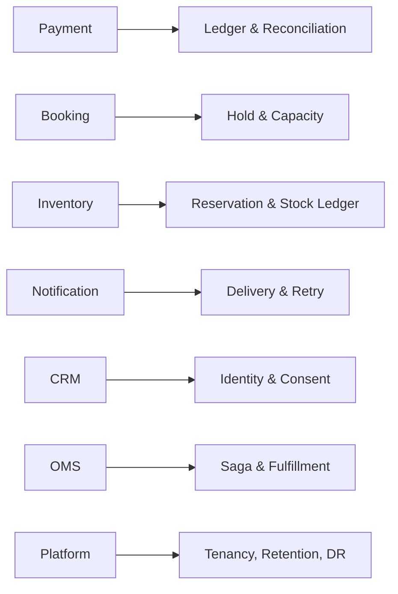

# Ma trận thiết kế Production

Tài liệu này giúp so sánh các quyết định kiến trúc trong `production/`. Không dùng ma trận như công thức chọn pattern; hãy bắt đầu từ invariant, failure model và yêu cầu vận hành của hệ thống.

## Cách sử dụng

1. Chọn capability gần với bài toán hiện tại.
2. Đọc invariant trước khi xem pattern.
3. Xác định source of truth và transaction boundary.
4. Liệt kê failure có thể xảy ra trước, trong và sau commit.
5. Mở bài chi tiết để xem diagram, test strategy, metric và runbook.

## Payment

| Capability | Invariant chính | Thiết kế/pattern nổi bật | Failure cần ưu tiên |
|---|---|---|---|
| [Gateway routing](payment-platform/modules/gateway-routing.md) | Một payment attempt giữ route ổn định khi retry | Strategy + Adapter + health policy | đổi gateway gây double charge |
| [Idempotency](payment-platform/modules/idempotency.md) | Cùng key và payload chỉ tạo một side effect | Idempotency Store | cùng key khác payload; request treo |
| [Ledger](payment-platform/modules/ledger.md) | Tổng debit bằng tổng credit | Double-entry, append-only | journal lệch; projection sai |
| [Reconciliation](payment-platform/modules/reconciliation.md) | Mọi settlement được matched hoặc thành exception có owner | Pipeline + exception workflow | missing/duplicate settlement |
| [Refund](payment-platform/modules/refund.md) | Tổng refund không vượt refundable amount | Aggregate + Adapter + ledger reversal | provider timeout; refund trùng |
| [Webhook inbox](payment-platform/modules/webhook-inbox.md) | Provider event được lưu và xử lý idempotent | Inbox Pattern | duplicate/out-of-order webhook |

## Booking

| Capability | Invariant chính | Thiết kế/pattern nổi bật | Failure cần ưu tiên |
|---|---|---|---|
| [Availability](booking-platform/modules/availability.md) | Kết quả search không phải cam kết cuối | Read Model + transactional recheck | stale slot |
| [Hold expiration](booking-platform/modules/hold-expiration.md) | Worker chỉ giải phóng đúng hold/version | Expiring aggregate + token | xóa hold đã gia hạn |
| [Overbooking](booking-platform/modules/overbooking.md) | Confirmed + active holds không vượt capacity | Conditional write/locking | race khi confirm |
| [Booking payment](booking-platform/modules/payment.md) | Không giữ tài nguyên vô hạn khi payment lỗi | Saga + compensation | payment success nhưng confirm timeout |
| [Waitlist](booking/07-waitlist.md) | Một slot chỉ được claim bởi một offer hợp lệ | Ordered queue + expiring offer | accept sau expiry |

## Inventory

| Capability | Invariant chính | Thiết kế/pattern nổi bật | Failure cần ưu tiên |
|---|---|---|---|
| [Reservation](inventory-platform/modules/reservation.md) | Active reservations không vượt available stock | Aggregate + optimistic/atomic write | oversell, duplicate release |
| [Stock ledger](inventory-platform/modules/stock-ledger.md) | Mọi thay đổi tồn kho có movement bất biến | Append-only ledger + projection | balance drift |
| [Cycle count](inventory-platform/modules/cycle-count.md) | Adjustment có reason và approval phù hợp | Workflow + variance policy | count sai, adjustment thiếu audit |
| [Warehouse routing](inventory-platform/modules/warehouse-routing.md) | Route không vi phạm capability và stock | Strategy + reservation | route dựa trên stale stock |
| [Reorder](inventory-platform/modules/reorder.md) | Recommendation có thể giải thích từ demand/lead time | Policy + approval | overstock/stockout do forecast sai |

## Notification

| Capability | Invariant chính | Thiết kế/pattern nổi bật | Failure cần ưu tiên |
|---|---|---|---|
| [Channel routing](notification-platform/modules/channel-routing.md) | Chỉ dùng channel được phép và route retry ổn định | Strategy + Adapter | vi phạm opt-out; fallback sai |
| [Retry](notification-platform/modules/retry.md) | Permanent failure không bị retry vô hạn | Retry Policy + DLQ | retry storm |
| [Outbox](notification-platform/modules/outbox.md) | Domain state và message intent commit cùng transaction | Transactional Outbox | publish trùng, lease treo |
| [Delivery tracking](notification-platform/modules/delivery-tracking.md) | Status không regression trái policy | Inbox + state machine | callback duplicate/out-of-order |
| [Template](notification-platform/modules/template.md) | Delivery pin đúng template version | Versioned template | biến thiếu, nội dung không audit được |

## CRM

| Capability | Invariant chính | Thiết kế/pattern nổi bật | Failure cần ưu tiên |
|---|---|---|---|
| [Consent](crm/07-consent.md) | Processing chỉ xảy ra khi effective consent hợp lệ | Versioned consent ledger | revocation không propagate |
| [Duplicate merge](crm/08-duplicate-merge.md) | Merge bảo toàn provenance và có thể điều tra | Merge plan + reversible audit | merge nhầm identity |
| [Assignment](crm-platform/modules/assignment.md) | Một lead có một owner hiệu lực | Policy + compare-and-set | concurrent assignment |
| [Lead scoring](crm-platform/modules/lead-scoring.md) | Score gắn model/feature version | Strategy/model boundary | model drift, score stale |
| [Privacy](crm-platform/modules/privacy.md) | Erasure tuân retention và legal hold | Workflow + evidence store | xóa quá mức hoặc bỏ sót |

## OMS

| Capability | Invariant chính | Thiết kế/pattern nổi bật | Failure cần ưu tiên |
|---|---|---|---|
| [Order state](order-management-system/modules/order-state.md) | Chỉ transition hợp lệ được commit | State Machine | side effect trước commit |
| [Allocation](order-management-system/modules/allocation.md) | Allocation không vượt stock được reserve | Policy + reservation | partial commit |
| [Cancellation](order-management-system/modules/cancellation.md) | Chỉ phần chưa hoàn tất mới được hủy | Planner + compensation | refund/release không đồng bộ |
| [Fulfillment](order-management-system/modules/fulfillment.md) | Quantity shipped không vượt allocated | Shipment aggregate | duplicate carrier event |
| [Saga](order-management-system/modules/saga.md) | Workflow tiến hoặc được compensate/escalate | Process Manager | stuck saga, duplicate event |
| [Return/refund](oms/08-return-refund.md) | Refund theo item đủ điều kiện và inspection | Return aggregate | refund trước khi nhận hàng |

## Platform

| Capability | Invariant chính | Thiết kế/pattern nổi bật | Failure cần ưu tiên |
|---|---|---|---|
| [Multi-tenancy](platform/01-multi-tenancy.md) | Không truy cập chéo tenant | Explicit tenant context | cache/job thiếu tenant key |
| [Rate limiting](platform/02-rate-limiting.md) | Limit được áp dụng atomically theo đúng subject | Token bucket/sliding window | counter race, retry storm |
| [Audit log](platform/03-audit-log.md) | Record append-only và đủ provenance | Immutable log | rò dữ liệu nhạy cảm |
| [Data retention](platform/04-data-retention.md) | Không xóa record có legal hold | Policy + evidence workflow | xóa sớm hoặc không xóa |
| [Disaster recovery](platform/05-disaster-recovery.md) | Recovery đáp ứng RPO/RTO đã cam kết | Backup/replication/runbook | backup không restore được |
| [Capacity planning](platform/06-capacity-planning.md) | Headroom dựa trên workload và bottleneck đo được | Forecast + load test | scale sai bottleneck |

## Câu hỏi review xuyên suốt

- Source of truth nằm ở đâu và có thể tái dựng projection không?
- Invariant được bảo vệ tại transaction boundary nào?
- Retry có thể tạo side effect trùng không?
- Event/callback có thể đến trễ, trùng hoặc sai thứ tự không?
- Metric nào phát hiện vi phạm trước khi khách hàng báo lỗi?
- Runbook có chỉ rõ cách dừng thiệt hại, phục hồi và reconciliation không?

## Bản đồ domain

Dùng ma trận để so sánh source of truth và failure model; không sao chép pattern giữa domain nếu invariant khác nhau.
