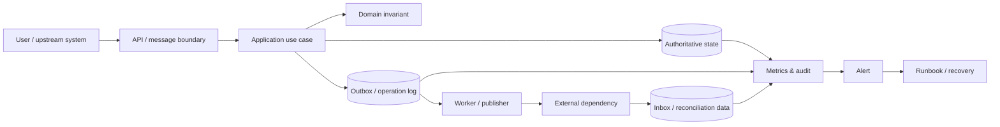

# Production Engineering — Từ pattern đến hệ thống vận hành được

Thư mục này tập trung vào điều pattern thường không nói hết: source of truth, transaction boundary, concurrency, idempotency, failure recovery, observability và runbook.

- [Ma trận thiết kế Production](PRODUCTION_DESIGN_MATRIX.md): so sánh invariant, pattern, source of truth và failure model theo capability.

## Mô hình production reference

## Cách đọc một module production

1. **Source of truth:** dữ liệu nào quyết định trạng thái cuối cùng?
2. **Invariant:** điều gì tuyệt đối không được sai, kể cả khi retry hoặc concurrent?
3. **Transaction boundary:** thay đổi nào atomic, thay đổi nào eventual?
4. **Failure matrix:** timeout trước/sau side effect, duplicate, out-of-order, stale version, partial outage.
5. **Recovery:** retry, compensation, reconciliation hay manual operation?
6. **Evidence:** test, metric, audit trail, dashboard và runbook.

## Platform map

| Platform | Invariant tiêu biểu | Failure khó nhất | Tài liệu |
|---|---|---|---|
| Booking | Không vượt capacity; hold có TTL rõ | Concurrent confirm / expiration race | [Booking](booking-platform/README.md) |
| CRM | Consent và provenance không bị mất | Merge/split identity sai hoặc privacy violation | [CRM](crm-platform/README.md) |
| Inventory | Conservation of quantity | Oversell, stale reservation, reconciliation mismatch | [Inventory](inventory-platform/README.md) |
| Notification | Một intent có delivery semantics rõ | Duplicate, provider outage, retry storm | [Notification](notification-platform/README.md) |
| OMS | State transition và fulfillment nhất quán | Partial fulfillment, cancel race, stuck saga | [Order Management](order-management-system/README.md) |
| Payment | Ledger cân bằng và idempotent operation | Timeout sau provider success, chargeback/reconciliation | [Payment](payment-platform/README.md) |

## Test strategy theo lớp rủi ro

- **Domain/property tests:** invariant như ledger balance, stock conservation, non-overlap.
- **Contract tests:** adapter/provider mapping và stable error taxonomy.
- **Integration tests:** transaction, unique constraint, optimistic lock, outbox/inbox.
- **Failure-injection tests:** timeout, duplicate, crash sau commit, out-of-order event.
- **Reconciliation tests:** external fact khác internal state.
- **Operational drills:** alert → runbook → recovery evidence.

## Design review checklist

- Operation ID/idempotency key có scope và payload conflict semantics rõ không?
- Retry có an toàn sau khi side effect có thể đã thành công không?
- State transition có guard và audit trail không?
- Metric đo technical activity hay business correctness?
- Dead-letter/manual queue có owner và SLA không?
- Rollback có đủ hay cần forward-fix/reconciliation?
- Data retention và privacy ảnh hưởng audit/replay thế nào?

## Definition of Done

Một module production chỉ hoàn thành khi:

- invariant được biểu diễn trong code và test;
- authoritative state và projection được phân biệt;
- failure matrix có response tương ứng;
- metric/alert gắn với user impact;
- runbook có bước xác minh recovery;
- migration và rollback/forward-fix được diễn tập;
- ADR ghi assumption và revisit condition.

## Bài tập nâng cao

Chọn một module trong sáu platform. Tạo “production evidence packet” gồm architecture diagram, invariant table, sequence cho happy/failure path, test matrix, dashboard mock, alert rule và runbook. Thực hiện tabletop exercise cho tình huống timeout sau external success.

## Tài liệu liên quan

- [Production Design Matrix](PRODUCTION_DESIGN_MATRIX.md)
- [Failure-oriented Design](../docs/09-expert-practice/03-failure-oriented-design.md)
- [Production Debugging Playbook](../docs/09-expert-practice/08-production-debugging-playbook.md)
- [Pattern Failure Atlas](../docs/09-expert-practice/12-pattern-failure-atlas.md)

## Review packet bắt buộc cho thay đổi rủi ro cao

Với thay đổi liên quan tiền, tồn kho, capacity, consent hoặc state machine, pull request nên đính kèm một review packet ngắn:

- sequence diagram cho happy path và failure path;
- bảng invariant cùng nơi enforce trong code/database;
- idempotency/concurrency decision;
- migration hoặc compatibility plan;
- dashboard/alert thay đổi;
- bước rollback, reconciliation hoặc manual repair;
- owner xác nhận sau release.

Packet này giúp reviewer đánh giá **correctness, reversibility và operability** thay vì chỉ xem class structure.
