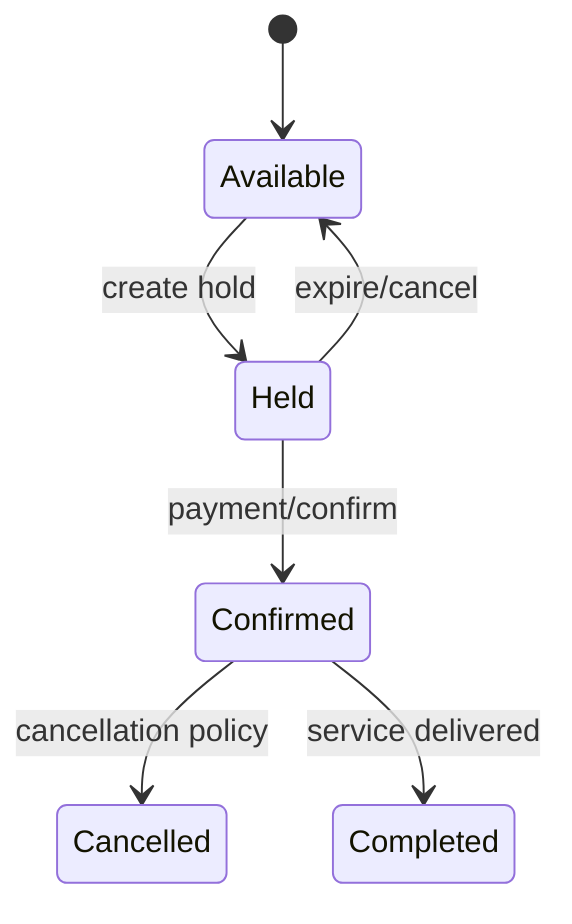

# Booking Platform

## Phạm vi

Case study này mô tả cách thiết kế và vận hành miền **booking** ở production. Trọng tâm không phải chia bao nhiêu service, mà là xác định source of truth, invariant, transaction boundary, failure recovery và evidence vận hành.

## Source of truth

**Resource Calendar / Hold** là trung tâm của thiết kế. Read model, cache hoặc provider status chỉ là projection/evidence; không được âm thầm thay thế source of truth.

## Invariant xuyên hệ thống

Hai booking confirmed không overlap cùng resource; hold hết hạn phải giải phóng capacity; timezone có quy tắc duy nhất.

## Bản đồ capability

## Failure model

Các tình huống bắt buộc có test hoặc tabletop exercise:

- Concurrent hold.
- clock skew.
- DST boundary.
- payment success sau hold expiry.
- overbooking policy.

Với **Booking Platform**, mỗi failure phải gắn với signal phát hiện đúng invariant, biện pháp containment giới hạn blast radius, recovery procedure, owner ra quyết định và evidence xác nhận dữ liệu/nghiệp vụ đã trở lại trạng thái hợp lệ.

## Modules

- [Availability](modules/availability.md)
- [Cancellation](modules/cancellation.md)
- [Hold Expiration](modules/hold-expiration.md)
- [Overbooking](modules/overbooking.md)
- [Payment](modules/payment.md)
- [Pricing](modules/pricing.md)

## Cách học

1. Vẽ interval semantics [start,end) và timezone policy trước khi đọc module.
2. Theo dõi hold token từ create đến confirm/expire.
3. Mô phỏng hai request giữ cùng resource và payment đến muộn.
4. Kiểm tra cancellation, waitlist/pricing và capacity release.
5. Viết ADR cho locking, hold TTL hoặc overbooking policy.

## Test strategy

- Property test hai booking confirmed không overlap.
- Boundary test DST, midnight và timezone conversion.
- Concurrency test conditional hold/confirm.
- Failure test payment success sau expiry và duplicate callback.
- Clock-controlled test expiration/release capacity.

## Observability

Theo dõi tối thiểu: **Hold conversion, expiry lag, overlap violation = 0, cancellation lead time, waitlist conversion**. Dashboard phải cho phép drill-down từ metric → business identifier → state transition → log/event → runbook.

## Definition of Done

- Interval/timezone semantics được ghi rõ và test.
- Hold có ownership token, TTL và idempotent confirm.
- Overlap violation bằng 0 hoặc theo policy explicit.
- Late payment có recovery/refund flow.
- Runbook xử lý stuck hold và calendar divergence.

## Enterprise operating model

- **Authoritative state:** Booking + Capacity Calendar. Mọi projection hoặc provider response phải truy ngược được về business identifier và version của state này.
- **Lifecycle cần mô hình hóa:** hold/confirm/cancel/expire. Transition không hợp lệ phải bị từ chối bằng reason có thể support/debug.
- **Failure rehearsal bắt buộc:** concurrent hold and timezone/DST overlap. Tabletop exercise phải chỉ ra detection, containment, recovery, owner và evidence đóng incident.
- **Signals tối thiểu:** overlap rejection, hold expiry, waitlist age. Alert phải gắn với customer impact hoặc invariant, không chỉ CPU/log volume.

### Release packet

Rollout availability hoặc hold policy theo resource cohort, dùng shadow overlap detector và calendar snapshot. Rollback phải bảo toàn hold đã cấp, không giải phóng nhầm slot và có kế hoạch xử lý booking tạo trong compatibility window.
