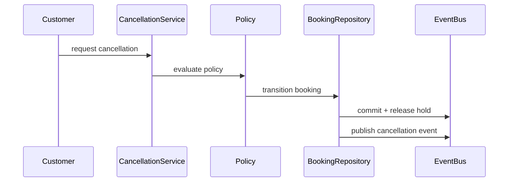

# Cancellation

## Vai trò trong hệ thống

**Cancellation** là capability chuyên biệt của **booking platform**. Module chỉ sở hữu quyết định và dữ liệu cần thiết cho cancellation; nó không được biến thành service tổng hợp cho toàn platform. Input/output phải dùng ngôn ngữ nghiệp vụ, còn database, broker và provider được đặt sau port/adapter rõ ràng.

## Invariant cần bảo vệ

- **Cancellation duy trì trạng thái hợp lệ và ownership rõ trong booking platform.**
- Mọi command có actor/correlation ID và chỉ được áp dụng một lần theo semantics của module.
- State transition phải kiểm tra precondition/version trước side effect bên ngoài.
- Correction không sửa projection trực tiếp; phải đi qua command hoặc reconciliation có audit.
- Tenant/currency/timezone/resource scope không được suy đoán ngầm.

## Thiết kế đề xuất

Cancellation policy là domain service tính eligibility, fee và inventory release theo thời điểm/loại vé. Việc hủy phải atomically chuyển trạng thái booking và phát event; refund/notification là hậu xử lý idempotent.

## Failure modes riêng của module

- duplicate cancellation; stale state; dependency timeout ở cancellation.
- Dependency có thể thành công nhưng response/ack bị mất, vì vậy retry mù có thể nhân đôi side effect.
- Event có thể đến trễ, trùng hoặc sai thứ tự; consumer phải dùng version/idempotency để quyết định bỏ qua hay reconcile.
- Dữ liệu projection/cache có thể cũ hơn source of truth và không được dùng để thực hiện correction không kiểm chứng.

## Chiến lược kiểm thử

1. Unit test invariant: **Cancellation giữ trạng thái hợp lệ theo rule của booking-platform**.
2. State-transition test cho happy path, invalid transition và stale version.
3. Idempotency test: cùng key/cùng payload trả cùng result; cùng key/khác payload bị từ chối.
4. Integration test transaction + outbox/inbox nếu module vừa đổi state vừa publish event.
5. Concurrency/failure-injection test ở trước commit, sau commit và khi dependency timeout.
6. Reconciliation test chứng minh projection có thể rebuild từ source of truth.

## Observability

Theo dõi **cancellation success rate, error rate, oldest pending age**. Log/trace tối thiểu gồm resource ID, tenant, correlation/idempotency key, command/event type, version và provider nếu có.

Dashboard của **cancellation** trong booking platform phải hiển thị phạm vi ảnh hưởng, giá trị nghiệp vụ liên quan, tuổi của item lâu nhất và xu hướng backlog. Alert ưu tiên breach của invariant hoặc SLA riêng của cancellation; exception count chỉ là tín hiệu chẩn đoán phụ.

## Runbook

1. Xác định phạm vi ảnh hưởng theo resource/tenant/time window và dừng automation có thể làm sai lệch tăng thêm.
2. Xác minh source of truth, transition cuối cùng đã commit và side effect bên ngoài có thực sự xảy ra hay chưa.
3. Cô lập cancellation, xác minh source of truth, replay command có idempotency key và kiểm tra kết quả.
4. Chạy verification query/contract check; mọi correction phải có actor, lý do và correlation ID.
5. Chỉ mở lại traffic/worker khi backlog, error rate và oldest pending age giảm ổn định.
6. Viết regression test hoặc guardrail tái hiện đúng failure vừa xảy ra.

## Câu hỏi design review

- Transaction boundary có đúng với invariant “Cancellation giữ trạng thái hợp lệ theo rule của booking-platform” không?
- Duplicate, stale version và out-of-order event được xử lý bằng semantics nào?
- Có đường reconcile khi dependency thành công nhưng response bị mất không?
- Metric **cancellation error rate; pending age; business impact** có phát hiện sai lệch trước khi khách hàng báo không?
- Runbook có thao tác an toàn, idempotent và có verification query không?

## Phạm vi tài liệu

Bài này mô tả **hủy booking và trả capacity về lịch khả dụng**. Trọng tâm là cancellation policy theo thời điểm, fee/refund, release hold/slot và đánh thức waitlist. Nó không thay thế OMS Cancellation, nơi đối tượng cần điều phối là order line, fulfillment và inventory allocation.