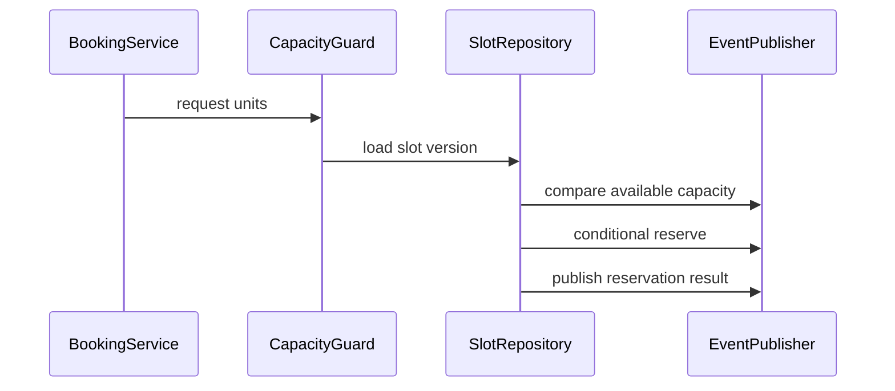
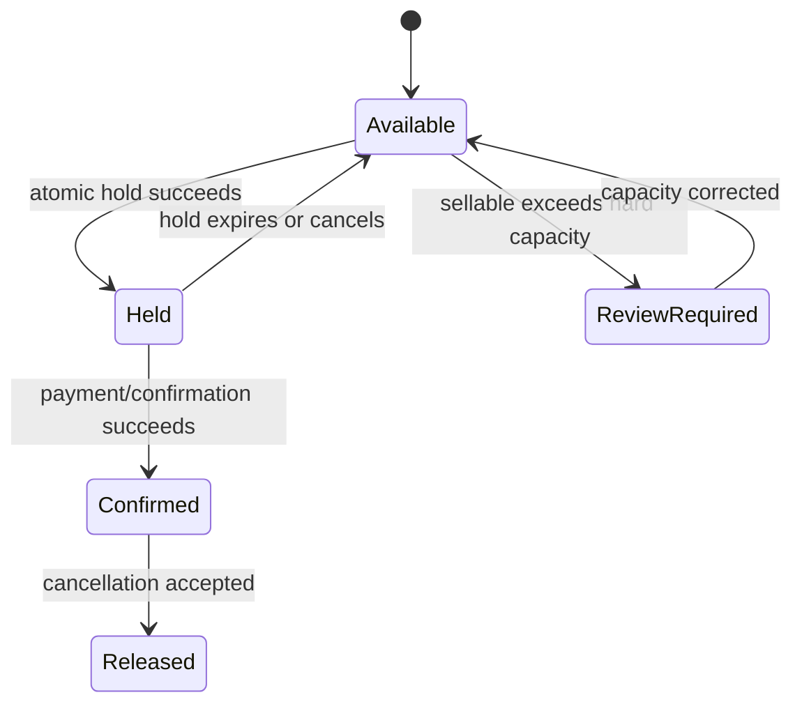

# Overbooking

## Vai trò trong hệ thống

**Overbooking** là capability chuyên biệt của **booking platform**. Module chỉ sở hữu quyết định và dữ liệu cần thiết cho overbooking; nó không được biến thành service tổng hợp cho toàn platform. Input/output phải dùng ngôn ngữ nghiệp vụ, còn database, broker và provider được đặt sau port/adapter rõ ràng.

## Invariant cần bảo vệ

- **Số booking confirmed không vượt capacity trừ policy overbook rõ.**
- Mọi command có actor/correlation ID và chỉ được áp dụng một lần theo semantics của module.
- State transition phải kiểm tra precondition/version trước side effect bên ngoài.
- Correction không sửa projection trực tiếp; phải đi qua command hoặc reconciliation có audit.
- Tenant/currency/timezone/resource scope không được suy đoán ngầm.

## Thiết kế đề xuất

Bảo vệ capacity bằng atomic conditional update hoặc row/version lock tại resource-slot. Read model chỉ phục vụ tìm kiếm; invariant `confirmed + active holds <= capacity` được kiểm tra trong write transaction.

## Failure modes riêng của module

- simultaneous confirm; stale availability cache; cancellation race.
- Dependency có thể thành công nhưng response/ack bị mất, vì vậy retry mù có thể nhân đôi side effect.
- Event có thể đến trễ, trùng hoặc sai thứ tự; consumer phải dùng version/idempotency để quyết định bỏ qua hay reconcile.
- Dữ liệu projection/cache có thể cũ hơn source of truth và không được dùng để thực hiện correction không kiểm chứng.

## Chiến lược kiểm thử

1. Concurrency contract test tại capacity guard: hai confirm cùng version chỉ một request thắng; request thua nhận conflict có thể re-evaluate.
2. State-transition test cho happy path, invalid transition và stale version.
3. Idempotency test: cùng key/cùng payload trả cùng result; cùng key/khác payload bị từ chối.
4. Integration test transaction + outbox/inbox nếu module vừa đổi state vừa publish event.
5. Concurrency/failure-injection test ở trước commit, sau commit và khi dependency timeout.
6. Reconciliation test chứng minh projection có thể rebuild từ source of truth.

## Observability

Theo dõi **capacity breach, confirm conflict, stale cache age**. Log/trace tối thiểu gồm resource ID, tenant, correlation/idempotency key, command/event type, version và provider nếu có.

Dashboard của **overbooking** trong booking platform phải hiển thị phạm vi ảnh hưởng, giá trị nghiệp vụ liên quan, tuổi của item lâu nhất và xu hướng backlog. Alert ưu tiên breach của invariant hoặc SLA riêng của overbooking; exception count chỉ là tín hiệu chẩn đoán phụ.

## Runbook

1. Xác định phạm vi ảnh hưởng theo resource/tenant/time window và dừng automation có thể làm sai lệch tăng thêm.
2. Xác minh source of truth, transition cuối cùng đã commit và side effect bên ngoài có thực sự xảy ra hay chưa.
3. Khóa inventory slot, kiểm tra booking/capacity, cancel/compensate theo policy.
4. Chạy verification query/contract check; mọi correction phải có actor, lý do và correlation ID.
5. Chỉ mở lại traffic/worker khi backlog, error rate và oldest pending age giảm ổn định.
6. Viết regression test hoặc guardrail tái hiện đúng failure vừa xảy ra.

## Câu hỏi design review

- Capacity guard nằm ở booking aggregate, inventory calendar hay database constraint, và mọi channel có đi qua cùng boundary không?
- Duplicate, stale version và out-of-order event được xử lý bằng semantics nào?
- Có đường reconcile khi dependency thành công nhưng response bị mất không?
- Metric **oversell count; compensation cost** có phát hiện sai lệch trước khi khách hàng báo không?
- Runbook có thao tác an toàn, idempotent và có verification query không?

## Phạm vi tài liệu

Tài liệu này tập trung riêng vào **Overbooking** trong `production/booking-platform/modules/overbooking.md`: ownership, invariant, failure recovery và evidence vận hành. Overview của platform mô tả quan hệ giữa các capability; bài này là contract review cho module và không thay thế runbook triển khai cụ thể của môi trường.

## Policy overbook có kiểm soát

Nếu nghiệp vụ cho phép overbook, policy phải là dữ liệu có version theo resource/time window, không phải hằng số nằm trong service. `hardCapacity` bảo vệ giới hạn vật lý; `sellableCapacity` có thể cao hơn theo policy nhưng mọi breach phải tạo audit event và exposure metric. Channel bán hàng không được tự tính capacity từ cache.

## State model của capacity

## Evidence phát hành

- Load test đồng thời trên cùng resource-slot với invariant kiểm tra sau mỗi run.
- Property test cho `confirmed + activeHolds <= sellableCapacity` và cảnh báo khi vượt `hardCapacity`.
- Metric exposure theo resource, expected compensation cost và thời gian còn lại trước service date.
- Playbook ưu tiên reaccommodation policy, customer communication và approval trail thay vì sửa trực tiếp projection.

## Phân biệt oversell và overbooking có chủ đích

Oversell là breach ngoài policy; overbooking có chủ đích là quyết định kinh doanh với giới hạn, thời gian áp dụng và owner phê duyệt. Hai trạng thái phải có metric và audit khác nhau. Policy version được lưu cùng booking để khi điều tra có thể biết capacity nào đã được dùng tại thời điểm confirm.

### Quyết định tại write path

Search availability có thể dùng projection/cache, nhưng confirm phải đi qua `CapacityGuard` đọc version mới nhất và thực hiện conditional write. Hold có expiry và ownership token; worker hết hạn chỉ release hold cùng token/version để không xóa hold mới được gia hạn. Mọi channel—web, agent, import—phải dùng cùng write boundary.

### Compensation policy

Khi vượt hard capacity, hệ thống không tự ý xóa booking cuối cùng. Workflow tạo case review, xếp hạng phương án theo policy (upgrade, alternate slot, refund), yêu cầu approval nếu chi phí vượt ngưỡng và lưu toàn bộ communication. Customer-impact metric quan trọng hơn exception count.

### Test matrix

| Scenario | Kỳ vọng |
|---|---|
| Hai confirm cùng slot/version | Một thành công, một conflict |
| Hold hết hạn đồng thời confirm | Token/version ngăn release sai |
| Cache báo còn chỗ nhưng write full | Confirm bị từ chối có thể re-search |
| Policy overbook thay đổi | Booking cũ giữ policy version cũ |
| Vượt hard capacity | Case compensation + alert được tạo |
