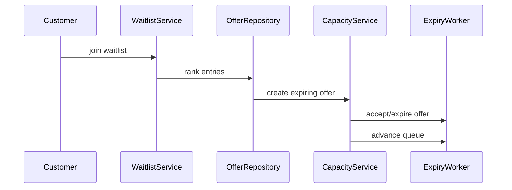

# Waitlist

## Vai trò trong hệ thống

**Waitlist** thuộc miền **booking** và chịu trách nhiệm cho một capability riêng, không phải service tổng hợp. **Waitlist** là capability chuyên biệt trong **booking**. Boundary chỉ nhận input theo ngôn ngữ nghiệp vụ của waitlist, bảo vệ invariant và phát result/event ổn định. Persistence, broker, scheduler hoặc provider phải nằm sau port/adapter; module không được trở thành service tổng hợp cho toàn platform.

## Invariant cần bảo vệ

- thứ tự ưu tiên và eligibility không bị phá.
- Mỗi command có idempotency/correlation key và kết quả ổn định khi retry.
- Transition quan trọng ghi actor, timestamp, version và lý do thay đổi.
- Không cập nhật trực tiếp projection để “sửa số”; mọi correction đi qua command có audit.

## Thiết kế đề xuất

Waitlist là ordered queue theo policy (priority, join time, customer tier). Khi có slot, tạo offer có TTL và token; hết hạn thì chuyển người tiếp theo, accept phải atomically claim capacity.

## Failure modes riêng của module

- slot race;
-  stale eligibility;
-  duplicate promotion.
- Response bị mất sau khi side effect đã commit, khiến caller không biết nên retry hay reconcile.
- Event đến trễ hoặc sai thứ tự làm projection khác source of truth.

## Chiến lược kiểm thử

1. Unit test invariant: **thứ tự ưu tiên và eligibility không bị phá**.
2. State-transition test cho happy path, invalid transition và stale version.
3. Idempotency test: cùng key/cùng payload trả cùng result; cùng key/khác payload bị từ chối.
4. Integration test transaction + outbox/inbox nếu module vừa đổi state vừa publish event.
5. Concurrency/failure-injection test ở trước commit, sau commit và khi dependency timeout.
6. Reconciliation test chứng minh projection có thể rebuild từ source of truth.

## Observability

Theo dõi **promotion latency; expired offer**. Mọi log/trace phải có resource ID, correlation ID, command type và version. Alert nên dựa trên business impact và age của item chưa hoàn tất; exception count đơn thuần không đủ phân biệt sự cố với retry bình thường.

## Runbook

1. Xác định source of truth và transition cuối cùng đã commit.
2. Khoanh vùng theo resource ID, correlation ID, idempotency key và version.
3. Tạm dừng worker/retry nếu chúng có thể làm sai lệch tăng thêm.
4. dừng promotion worker, rebuild queue order và reissue offer idempotently.
5. Chạy verification query, ghi audit cho mọi correction và chỉ mở lại traffic khi metric trở về ngưỡng an toàn.
6. Bổ sung test/guardrail cho failure vừa xảy ra.

## Câu hỏi design review

- Transaction boundary có đúng với invariant “thứ tự ưu tiên và eligibility không bị phá” không?
- Duplicate, stale version và out-of-order event được xử lý bằng semantics nào?
- Có đường reconcile khi dependency thành công nhưng response bị mất không?
- Metric **promotion latency; expired offer** có phát hiện sai lệch trước khi khách hàng báo không?
- Runbook có thao tác an toàn, idempotent và có verification query không?

## Phạm vi tài liệu

Đây là **chuyên đề tình huống nâng cao** cho `production/booking/07-waitlist.md`. Nội dung tập trung vào waitlist ở boundary này, không thay thế overview của platform.
