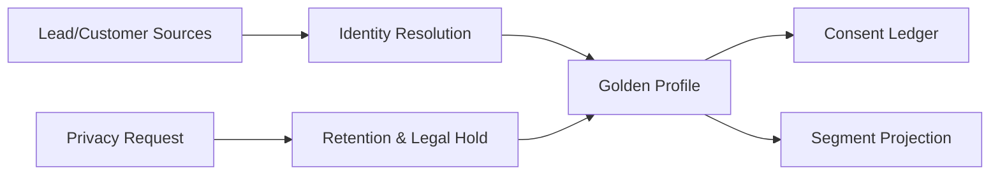

# CRM Platform

## Phạm vi

Case study này mô tả cách thiết kế và vận hành miền **crm** ở production. Trọng tâm không phải chia bao nhiêu service, mà là xác định source of truth, invariant, transaction boundary, failure recovery và evidence vận hành.

## Source of truth

**Customer Identity / Consent Ledger** là trung tâm của thiết kế. Read model, cache hoặc provider status chỉ là projection/evidence; không được âm thầm thay thế source of truth.

## Invariant xuyên hệ thống

Merge không làm mất provenance; consent phải versioned; privacy request phải audit được và tuân thủ legal hold.

## Bản đồ capability

## Failure model

Các tình huống bắt buộc có test hoặc tabletop exercise:

- False merge.
- duplicate identity.
- consent race.
- stale segment.
- deletion conflict với legal hold.

Với **CRM Platform**, mỗi failure phải gắn với signal phát hiện đúng invariant, biện pháp containment giới hạn blast radius, recovery procedure, owner ra quyết định và evidence xác nhận dữ liệu/nghiệp vụ đã trở lại trạng thái hợp lệ.

## Modules

- [Activity](modules/activity.md)
- [Assignment](modules/assignment.md)
- [Lead Scoring](modules/lead-scoring.md)
- [Pipeline](modules/pipeline.md)
- [Privacy](modules/privacy.md)
- [Segmentation](modules/segmentation.md)

## Cách học

1. Theo dõi một identity từ nhiều source đến golden profile.
2. Vẽ provenance cho merge/split và consent history.
3. Mô phỏng false merge, concurrent consent update và privacy request.
4. Kiểm tra segmentation freshness và downstream audience.
5. Viết ADR cho matching threshold, legal hold hoặc deletion policy.

## Test strategy

- Property test merge không làm mất source identifiers.
- Contract test consent purpose/channel/version.
- Integration test optimistic version khi merge/split.
- Failure test deletion xung đột legal hold và downstream copy.
- Projection test segment membership theo rule version.

## Observability

Theo dõi tối thiểu: **Merge reversal rate, consent violation = 0, profile freshness, privacy SLA, unresolved duplicates**. Dashboard phải cho phép drill-down từ metric → business identifier → state transition → log/event → runbook.

## Definition of Done

- Merge/split reversible bằng provenance.
- Consent ledger append-only và query được theo thời điểm.
- Privacy SLA và legal hold được test.
- Segmentation ghi rule/data version.
- Runbook xử lý false merge và consent violation.

## Enterprise operating model

- **Authoritative state:** Party Identity + Consent Ledger. Mọi projection hoặc provider response phải truy ngược được về business identifier và version của state này.
- **Lifecycle cần mô hình hóa:** create/merge/split/consent/delete. Transition không hợp lệ phải bị từ chối bằng reason có thể support/debug.
- **Failure rehearsal bắt buộc:** wrong merge or consent version mismatch. Tabletop exercise phải chỉ ra detection, containment, recovery, owner và evidence đóng incident.
- **Signals tối thiểu:** merge reversal, consent violation, deletion SLA. Alert phải gắn với customer impact hoặc invariant, không chỉ CPU/log volume.

### Release packet

Rollout identity/consent change theo tenant, giữ merge audit và dual-read consent version. Rollback phải phục hồi provenance, không đảo ngược deletion đã hoàn tất sai quy định và có owner cho unmatched identity.
