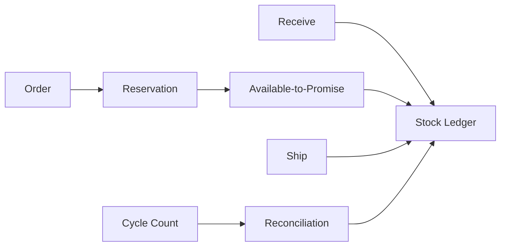

# Inventory Platform

## Phạm vi

Case study này mô tả cách thiết kế và vận hành miền **inventory** ở production. Trọng tâm không phải chia bao nhiêu service, mà là xác định source of truth, invariant, transaction boundary, failure recovery và evidence vận hành.

## Source of truth

**Stock Ledger / Reservation** là trung tâm của thiết kế. Read model, cache hoặc provider status chỉ là projection/evidence; không được âm thầm thay thế source of truth.

## Invariant xuyên hệ thống

On-hand = ledger sum; available = on-hand - active reservations; quantity không mất hoặc sinh ra ngoài movement.

## Bản đồ capability

## Failure model

Các tình huống bắt buộc có test hoặc tabletop exercise:

- Oversell race.
- stale reservation.
- duplicate movement.
- negative stock.
- projection lag.

Với **Inventory Platform**, mỗi failure phải gắn với signal phát hiện đúng invariant, biện pháp containment giới hạn blast radius, recovery procedure, owner ra quyết định và evidence xác nhận dữ liệu/nghiệp vụ đã trở lại trạng thái hợp lệ.

## Modules

- [Concurrency](modules/concurrency.md)
- [Cycle Count](modules/cycle-count.md)
- [Reorder](modules/reorder.md)
- [Reservation](modules/reservation.md)
- [Stock Ledger](modules/stock-ledger.md)
- [Warehouse Routing](modules/warehouse-routing.md)

## Cách học

1. Bắt đầu từ stock movement ledger thay vì quantity mutable.
2. Theo dõi reservation, allocation, ship và release bằng operation id.
3. Mô phỏng concurrent reserve và projection lag.
4. Đối chiếu cycle count với ledger/reconciliation.
5. Viết ADR cho locking, reservation TTL hoặc warehouse routing.

## Test strategy

- Property test conservation of quantity qua movement sequence.
- Concurrency test available-to-promise không âm.
- Idempotency test duplicate receive/ship/release.
- Projection test rebuild từ ledger cho cùng kết quả.
- Reconciliation test cycle-count adjustment có audit reason.

## Observability

Theo dõi tối thiểu: **Reservation conflict, ATP divergence, stale reservation age, reconciliation delta, negative availability = 0**. Dashboard phải cho phép drill-down từ metric → business identifier → state transition → log/event → runbook.

## Definition of Done

- On-hand có thể tái tạo từ ledger.
- Reservation lifecycle và TTL rõ ràng.
- Không oversell ngoài policy explicit.
- Projection lag được đo và có fallback.
- Reconciliation/cycle-count có approval và runbook.

## Enterprise operating model

- **Authoritative state:** StockLedger + Reservation. Mọi projection hoặc provider response phải truy ngược được về business identifier và version của state này.
- **Lifecycle cần mô hình hóa:** receive/reserve/commit/release/reconcile. Transition không hợp lệ phải bị từ chối bằng reason có thể support/debug.
- **Failure rehearsal bắt buộc:** stale reservation and concurrent checkout. Tabletop exercise phải chỉ ra detection, containment, recovery, owner và evidence đóng incident.
- **Signals tối thiểu:** negative ATP, conflict rate, reconciliation delta. Alert phải gắn với customer impact hoặc invariant, không chỉ CPU/log volume.

### Release packet

Rollout reservation/ATP calculation theo SKU cohort, so sánh projection với stock ledger và chặn negative availability. Rollback phải giữ operation id, release stale reservation và chạy reconciliation trước khi mở lại traffic.
