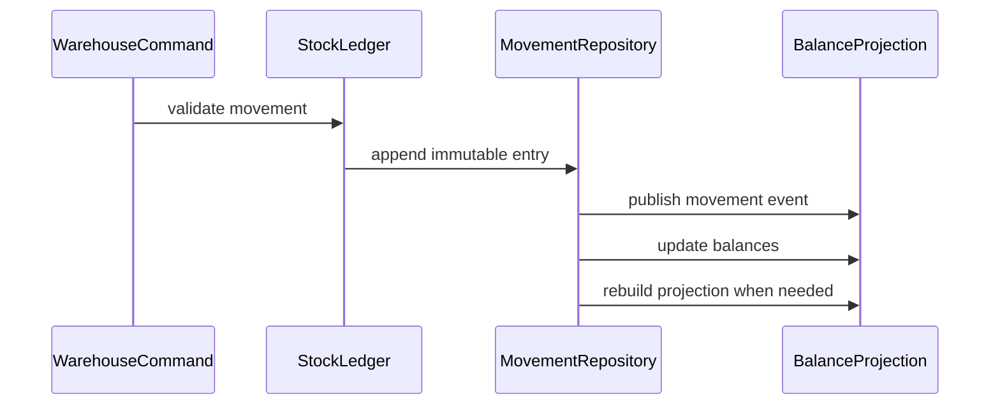

# Stock Ledger

## Vai trò trong hệ thống

**Stock Ledger** là capability chuyên biệt của **inventory platform**. Module chỉ sở hữu quyết định và dữ liệu cần thiết cho stock ledger; nó không được biến thành service tổng hợp cho toàn platform. Input/output phải dùng ngôn ngữ nghiệp vụ, còn database, broker và provider được đặt sau port/adapter rõ ràng.

## Invariant cần bảo vệ

- **Stock ledger duy trì trạng thái hợp lệ và ownership rõ trong inventory platform.**
- Mọi command có actor/correlation ID và chỉ được áp dụng một lần theo semantics của module.
- State transition phải kiểm tra precondition/version trước side effect bên ngoài.
- Correction không sửa projection trực tiếp; phải đi qua command hoặc reconciliation có audit.
- Tenant/currency/timezone/resource scope không được suy đoán ngầm.

## Thiết kế đề xuất

Stock ledger append-only ghi receipt, reservation, release, shipment và adjustment. On-hand/available là projection; correction dùng compensating entry để bảo toàn lịch sử.

## Failure modes riêng của module

- duplicate stock ledger; stale state; dependency timeout ở stock ledger.
- Dependency có thể thành công nhưng response/ack bị mất, vì vậy retry mù có thể nhân đôi side effect.
- Event có thể đến trễ, trùng hoặc sai thứ tự; consumer phải dùng version/idempotency để quyết định bỏ qua hay reconcile.
- Dữ liệu projection/cache có thể cũ hơn source of truth và không được dùng để thực hiện correction không kiểm chứng.

## Chiến lược kiểm thử

1. Property test: `on_hand = opening + receipts - issues + adjustments`.
2. Duplicate movement test theo source reference.
3. Concurrent append test bảo toàn version/order của SKU-location stream.
4. Projection rebuild test khớp available/reserved/on-hand.
5. Reconciliation test tạo adjustment có reason/actor thay vì sửa movement cũ.

## Observability

Theo dõi **stock ledger success rate, error rate, oldest pending age**. Log/trace tối thiểu gồm resource ID, tenant, correlation/idempotency key, command/event type, version và provider nếu có.

Dashboard của **stock ledger** trong inventory platform phải hiển thị phạm vi ảnh hưởng, giá trị nghiệp vụ liên quan, tuổi của item lâu nhất và xu hướng backlog. Alert ưu tiên breach của invariant hoặc SLA riêng của stock ledger; exception count chỉ là tín hiệu chẩn đoán phụ.

## Runbook

1. Xác định phạm vi ảnh hưởng theo resource/tenant/time window và dừng automation có thể làm sai lệch tăng thêm.
2. Xác minh source of truth, transition cuối cùng đã commit và side effect bên ngoài có thực sự xảy ra hay chưa.
3. Cô lập stock ledger, xác minh source of truth, replay command có idempotency key và kiểm tra kết quả.
4. Chạy verification query/contract check; mọi correction phải có actor, lý do và correlation ID.
5. Chỉ mở lại traffic/worker khi backlog, error rate và oldest pending age giảm ổn định.
6. Viết regression test hoặc guardrail tái hiện đúng failure vừa xảy ra.

## Câu hỏi design review

- Movement có immutable và đủ provenance để replay không?
- Reservation/available là projection hay source of truth?
- Duplicate receipt/issue được deduplicate bằng khóa nào?
- Cycle count variance dẫn tới adjustment workflow và approval ra sao?

## Phạm vi tài liệu

Tài liệu này tập trung riêng vào **Stock Ledger** trong `production/inventory-platform/modules/stock-ledger.md`: ownership, invariant, failure recovery và evidence vận hành. Overview của platform mô tả quan hệ giữa các capability; bài này là contract review cho module và không thay thế runbook triển khai cụ thể của môi trường.
