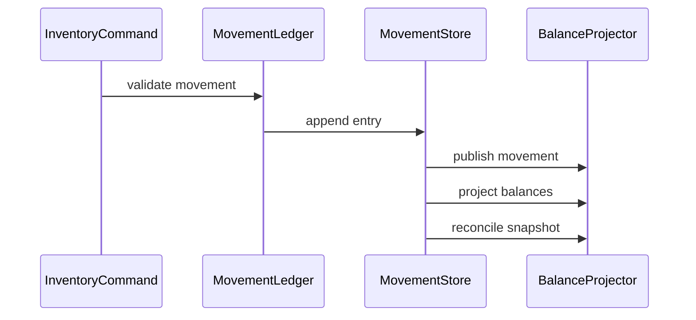

# Stock Ledger

## Vai trò trong hệ thống

**Stock Ledger** thuộc miền **inventory** và chịu trách nhiệm cho một capability riêng, không phải service tổng hợp. **Stock Ledger** là capability chuyên biệt trong **inventory**. Boundary chỉ nhận input theo ngôn ngữ nghiệp vụ của stock ledger, bảo vệ invariant và phát result/event ổn định. Persistence, broker, scheduler hoặc provider phải nằm sau port/adapter; module không được trở thành service tổng hợp cho toàn platform.

## Invariant cần bảo vệ

- mọi movement bất biến và balance suy ra được.
- Mỗi command có idempotency/correlation key và kết quả ổn định khi retry.
- Transition quan trọng ghi actor, timestamp, version và lý do thay đổi.
- Không cập nhật trực tiếp projection để “sửa số”; mọi correction đi qua command có audit.

## Thiết kế đề xuất

Dùng movement ledger append-only làm source of truth cho receipt, reserve, ship và adjust. Balance được project theo SKU/location; correction tạo movement bù có reference.

## Failure modes riêng của module

- double posting;
-  missing posting;
-  stale projection.
- Response bị mất sau khi side effect đã commit, khiến caller không biết nên retry hay reconcile.
- Event đến trễ hoặc sai thứ tự làm projection khác source of truth.

## Chiến lược kiểm thử

1. Unit test từng movement type và sign convention.
2. Scenario test receipt → reserve → ship → return.
3. Test out-of-order integration event được giữ/chạy lại đúng version.
4. Test read model có thể rebuild sau khi xóa projection.
5. Test audit export truy ngược được actor, source document và correlation id.

## Observability

Theo dõi **ledger imbalance; posting lag**. Mọi log/trace phải có resource ID, correlation ID, command type và version. Alert nên dựa trên business impact và age của item chưa hoàn tất; exception count đơn thuần không đủ phân biệt sự cố với retry bình thường.

## Runbook

1. Xác định source of truth và transition cuối cùng đã commit.
2. Khoanh vùng theo resource ID, correlation ID, idempotency key và version.
3. Tạm dừng worker/retry nếu chúng có thể làm sai lệch tăng thêm.
4. replay projection từ checkpoint đã xác minh.
5. Chạy verification query, ghi audit cho mọi correction và chỉ mở lại traffic khi metric trở về ngưỡng an toàn.
6. Bổ sung test/guardrail cho failure vừa xảy ra.

## Câu hỏi design review

- Boundary module này sở hữu movement taxonomy hay chỉ consume event từ hệ khác?
- Ordering theo SKU, location hay aggregate version?
- Return/correction có tạo movement mới thay vì mutate history không?
- Báo cáo audit có tái tạo được balance tại một thời điểm bất kỳ không?

## Phạm vi tài liệu

Đây là **chuyên đề tình huống nâng cao** cho `production/inventory/07-stock-ledger.md`. Nội dung tập trung vào stock ledger ở boundary này, không thay thế overview của platform.
