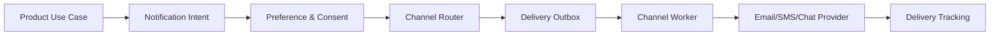

# Notification Platform

## Phạm vi

Case study này mô tả cách thiết kế và vận hành miền **notification** ở production. Trọng tâm không phải chia bao nhiêu service, mà là xác định source of truth, invariant, transaction boundary, failure recovery và evidence vận hành.

## Source of truth

**Notification Intent / Delivery Attempt** là trung tâm của thiết kế. Read model, cache hoặc provider status chỉ là projection/evidence; không được âm thầm thay thế source of truth.

## Invariant xuyên hệ thống

Không gửi khi opt-out; một intent không tạo delivery trùng; template/version phải truy vết được.

## Bản đồ capability

## Failure model

Các tình huống bắt buộc có test hoặc tabletop exercise:

- Provider throttling.
- invalid recipient.
- duplicate retry.
- consent thay đổi giữa enqueue và send.
- template drift.

Với **Notification Platform**, mỗi failure phải gắn với signal phát hiện đúng invariant, biện pháp containment giới hạn blast radius, recovery procedure, owner ra quyết định và evidence xác nhận dữ liệu/nghiệp vụ đã trở lại trạng thái hợp lệ.

## Modules

- [Channel Routing](modules/channel-routing.md)
- [Delivery Tracking](modules/delivery-tracking.md)
- [Outbox](modules/outbox.md)
- [Preference](modules/preference.md)
- [Retry](modules/retry.md)
- [Template](modules/template.md)

## Cách học

1. Theo dõi NotificationIntent từ preference check đến delivery receipt.
2. So sánh route email/SMS/chat theo consent, urgency và cost.
3. Mô phỏng provider throttle, invalid recipient và retry exhaustion.
4. Kiểm tra template version và locale tại thời điểm enqueue/send.
5. Viết ADR cho delivery semantics hoặc provider fallback.

## Test strategy

- Property test opt-out không bao giờ tạo DeliveryAttempt.
- Contract test cho email/SMS/chat adapter và error classification.
- Integration test outbox claim, retry schedule và dead-letter.
- Failure test duplicate worker, stale consent và provider timeout.
- Projection test delivery status không lùi trạng thái.

## Observability

Theo dõi tối thiểu: **Queue lag, delivery latency, permanent failure rate, suppression rate, duplicate delivery rate**. Dashboard phải cho phép drill-down từ metric → business identifier → state transition → log/event → runbook.

## Definition of Done

- Consent được kiểm tra tại boundary đã quyết định và có audit.
- Một intent không tạo delivery trùng ngoài policy.
- Template/version/provider được truy vết.
- Retry phân biệt temporary/permanent.
- Dashboard nối queue lag, failure và suppression với runbook.

## Enterprise operating model

- **Authoritative state:** NotificationAttempt + DeliveryReceipt. Mọi projection hoặc provider response phải truy ngược được về business identifier và version của state này.
- **Lifecycle cần mô hình hóa:** route/send/fallback/deliver. Transition không hợp lệ phải bị từ chối bằng reason có thể support/debug.
- **Failure rehearsal bắt buộc:** provider accepted but callback missing. Tabletop exercise phải chỉ ra detection, containment, recovery, owner và evidence đóng incident.
- **Signals tối thiểu:** queue age, delivery latency, duplicate send, fallback rate. Alert phải gắn với customer impact hoặc invariant, không chỉ CPU/log volume.

### Release packet

Rollout provider/channel mới theo message class và tenant, giữ fallback cũ, so sánh accepted/delivered latency và kiểm tra unsubscribe/consent. Rollback cần drain queue hoặc reroute mà không gửi lại message đã delivered.
