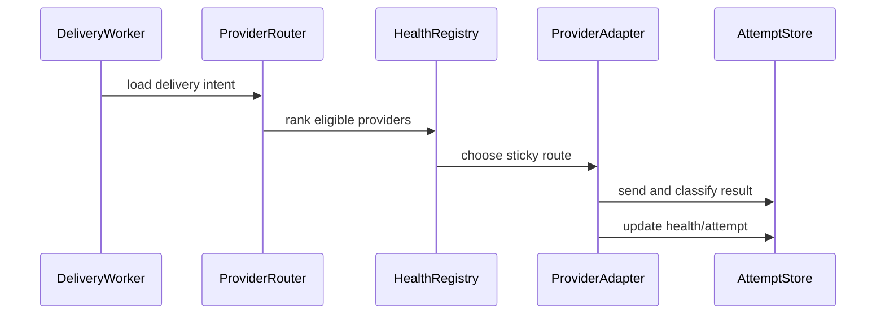

# Provider Routing

## Vai trò trong hệ thống

**Provider Routing** thuộc miền **notification** và chịu trách nhiệm cho một capability riêng, không phải service tổng hợp. **Provider Routing** là capability chuyên biệt trong **notification**. Boundary chỉ nhận input theo ngôn ngữ nghiệp vụ của provider routing, bảo vệ invariant và phát result/event ổn định. Persistence, broker, scheduler hoặc provider phải nằm sau port/adapter; module không được trở thành service tổng hợp cho toàn platform.

## Invariant cần bảo vệ

- route chỉ tới provider đủ capability và health.
- Mỗi command có idempotency/correlation key và kết quả ổn định khi retry.
- Transition quan trọng ghi actor, timestamp, version và lý do thay đổi.
- Không cập nhật trực tiếp projection để “sửa số”; mọi correction đi qua command có audit.

## Thiết kế đề xuất

Provider router dùng health, region, capability, cost và quota. Route được sticky theo notification/idempotency key; circuit breaker loại provider lỗi và fallback chỉ chạy khi message semantics cho phép.

## Failure modes riêng của module

- all providers degraded;
-  sticky failure;
-  cost rule drift.
- Response bị mất sau khi side effect đã commit, khiến caller không biết nên retry hay reconcile.
- Event đến trễ hoặc sai thứ tự làm projection khác source of truth.

## Chiến lược kiểm thử

1. Unit test invariant: **route chỉ tới provider đủ capability và health**.
2. State-transition test cho happy path, invalid transition và stale version.
3. Idempotency test: cùng key/cùng payload trả cùng result; cùng key/khác payload bị từ chối.
4. Integration test transaction + outbox/inbox nếu module vừa đổi state vừa publish event.
5. Concurrency/failure-injection test ở trước commit, sau commit và khi dependency timeout.
6. Reconciliation test chứng minh projection có thể rebuild từ source of truth.

## Observability

Theo dõi **route error rate; fallback rate; cost per delivery**. Mọi log/trace phải có resource ID, correlation ID, command type và version. Alert nên dựa trên business impact và age của item chưa hoàn tất; exception count đơn thuần không đủ phân biệt sự cố với retry bình thường.

## Runbook

1. Xác định source of truth và transition cuối cùng đã commit.
2. Khoanh vùng theo resource ID, correlation ID, idempotency key và version.
3. Tạm dừng worker/retry nếu chúng có thể làm sai lệch tăng thêm.
4. pin safe provider, disable bad route rule và drain retry queue.
5. Chạy verification query, ghi audit cho mọi correction và chỉ mở lại traffic khi metric trở về ngưỡng an toàn.
6. Bổ sung test/guardrail cho failure vừa xảy ra.

## Câu hỏi design review

- Transaction boundary có đúng với invariant “route chỉ tới provider đủ capability và health” không?
- Duplicate, stale version và out-of-order event được xử lý bằng semantics nào?
- Có đường reconcile khi dependency thành công nhưng response bị mất không?
- Metric **route error rate; fallback rate; cost per delivery** có phát hiện sai lệch trước khi khách hàng báo không?
- Runbook có thao tác an toàn, idempotent và có verification query không?

## Phạm vi tài liệu

Đây là **chuyên đề tình huống nâng cao** cho `production/notification/08-provider-routing.md`. Nội dung tập trung vào provider routing ở boundary này, không thay thế overview của platform.
