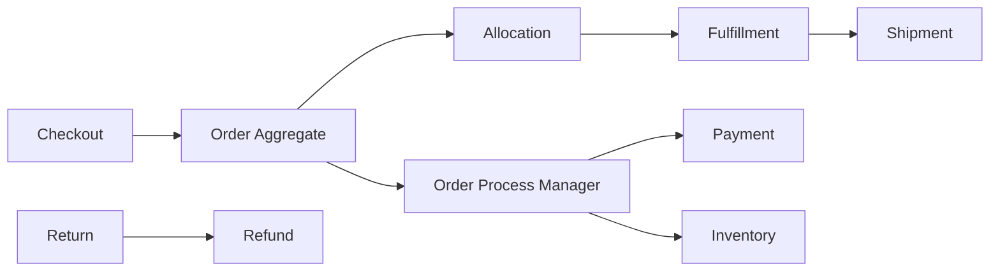

# Order Management System

## Phạm vi

Case study này mô tả cách thiết kế và vận hành miền **order** ở production. Trọng tâm không phải chia bao nhiêu service, mà là xác định source of truth, invariant, transaction boundary, failure recovery và evidence vận hành.

## Source of truth

**Order Aggregate / Process Manager** là trung tâm của thiết kế. Read model, cache hoặc provider status chỉ là projection/evidence; không được âm thầm thay thế source of truth.

## Invariant xuyên hệ thống

Order transition hợp lệ; allocation không vượt stock; refund/return liên kết đúng fulfillment và payment.

## Bản đồ capability

## Failure model

Các tình huống bắt buộc có test hoặc tabletop exercise:

- Partial allocation.
- payment authorized nhưng stock fail.
- duplicate shipment event.
- cancellation race.
- stuck saga.

Mỗi failure cần ghi rõ: detection, containment, recovery, owner và evidence xác nhận đã phục hồi.

## Modules

- [Allocation](modules/allocation.md)
- [Audit](modules/audit.md)
- [Cancellation](modules/cancellation.md)
- [Fulfillment](modules/fulfillment.md)
- [Order State](modules/order-state.md)
- [Saga](modules/saga.md)

## Cách học

1. Theo dõi Order từ place đến allocation, fulfillment, cancellation/return.
2. Vẽ process manager cho payment và inventory thay vì transaction phân tán.
3. Mô phỏng partial allocation, duplicate shipment event và stuck saga.
4. Đối chiếu refund với fulfilled/returned line.
5. Viết ADR cho orchestration, compensation hoặc split shipment.

## Test strategy

- State-machine test legal/illegal order transitions.
- Contract test payment/inventory/fulfillment ports.
- Integration test outbox và saga state persistence.
- Failure test partial success, duplicate event và compensation retry.
- Reconciliation test stuck order và orphan allocation.

## Observability

Theo dõi tối thiểu: **Order stuck age, compensation rate, allocation latency, partial fulfillment rate, return/refund SLA**. Dashboard phải cho phép drill-down từ metric → business identifier → state transition → log/event → runbook.

## Definition of Done

- Order transition và line-level quantity invariant được test.
- Saga command/event idempotent và có timeout.
- Partial fulfillment/cancel semantics rõ.
- Return/refund liên kết đúng shipment/payment.
- Dashboard và runbook xử lý stuck saga/compensation.

## Enterprise operating model

- **Authoritative state:** Order Aggregate + Process Manager. Mọi projection hoặc provider response phải truy ngược được về business identifier và version của state này.
- **Lifecycle cần mô hình hóa:** place/allocate/fulfill/cancel/return. Transition không hợp lệ phải bị từ chối bằng reason có thể support/debug.
- **Failure rehearsal bắt buộc:** partial fulfillment and late payment event. Tabletop exercise phải chỉ ra detection, containment, recovery, owner và evidence đóng incident.
- **Signals tối thiểu:** stuck order age, compensation failure, transition reject. Alert phải gắn với customer impact hoặc invariant, không chỉ CPU/log volume.

### Release packet

Rollout orchestration/state transition theo order cohort, shadow process-manager decision và theo dõi stuck state. Rollback phải biết order nào đã phát command ra payment/inventory/fulfillment để compensation hoặc manual recovery.
