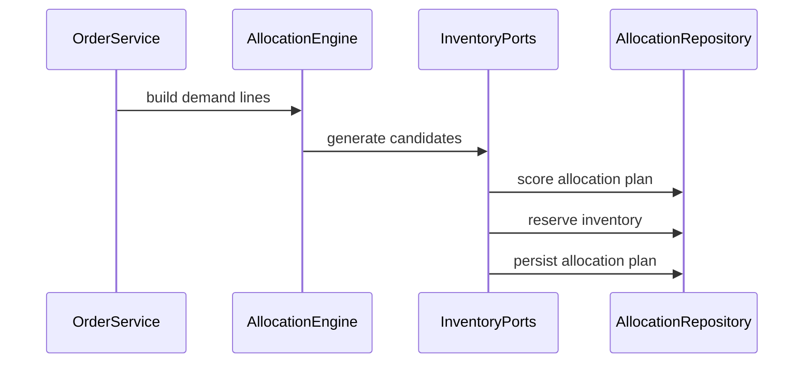

# Allocation

## Vai trò trong hệ thống

**Allocation** là capability chuyên biệt của **order management system**. Module chỉ sở hữu quyết định và dữ liệu cần thiết cho allocation; nó không được biến thành service tổng hợp cho toàn platform. Input/output phải dùng ngôn ngữ nghiệp vụ, còn database, broker và provider được đặt sau port/adapter rõ ràng.

## Invariant cần bảo vệ

- Allocation giữ trạng thái hợp lệ theo rule của order-management-system.
- Mỗi command có idempotency/correlation key và kết quả ổn định khi retry.
- Transition quan trọng ghi actor, timestamp, version và lý do thay đổi.
- Không cập nhật trực tiếp projection để “sửa số”; mọi correction đi qua command có audit.

## Thiết kế đề xuất

Allocation tách candidate generation khỏi commitment. Policy xét inventory, warehouse, SLA và split; commit reservations atomically theo chiến lược all-or-nothing hoặc partial được domain cho phép.

## Failure modes riêng của module

- Hai warehouse cùng allocate dòng hàng cuối.
- Reservation hết TTL nhưng order vẫn giữ allocation.
- Inventory accepted nhưng OMS mất response.

## Chiến lược kiểm thử

1. Concurrency test cùng SKU/location với optimistic version.
2. Property test allocated quantity không vượt ordered/available snapshot.
3. Reconciliation test OMS allocation với inventory reservation.

## Observability

Theo dõi **allocation conflict rate, reservation expiry age, unallocated-order age**. Log/trace phải có order ID, correlation ID, command/event type và aggregate version; alert ưu tiên business age/mismatch thay vì exception count đơn thuần.

## Runbook

1. Tạm dừng allocation cho SKU/location bị lệch.
2. So sánh order allocation với inventory reservation source of truth.
3. Release reservation mồ côi hoặc replay command bằng cùng idempotency key.
4. Mở lại traffic sau khi conservation query và backlog trở về ngưỡng.

## Câu hỏi design review

- Transaction boundary có đúng với invariant “Allocation giữ trạng thái hợp lệ theo rule của order-management-system” không?
- Duplicate, stale version và out-of-order event được xử lý bằng semantics nào?
- Có đường reconcile khi dependency thành công nhưng response bị mất không?
- Metric **allocation error rate; pending age; business impact** có phát hiện sai lệch trước khi khách hàng báo không?
- Runbook có thao tác an toàn, idempotent và có verification query không?

## Phạm vi tài liệu

Tài liệu này tập trung riêng vào **Allocation** trong `production/order-management-system/modules/allocation.md`: ownership, invariant, failure recovery và evidence vận hành. Overview của platform mô tả quan hệ giữa các capability; bài này là contract review cho module và không thay thế runbook triển khai cụ thể của môi trường.
