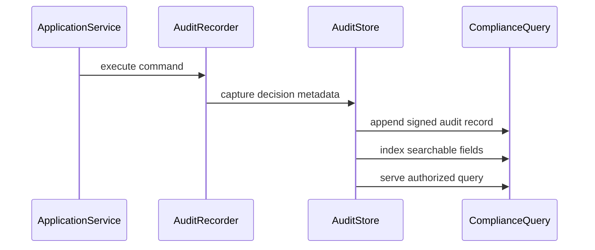

# Audit

## Vai trò trong hệ thống

**Audit** là capability chuyên biệt của **order management system**. Module chỉ sở hữu quyết định và dữ liệu cần thiết cho audit; nó không được biến thành service tổng hợp cho toàn platform. Input/output phải dùng ngôn ngữ nghiệp vụ, còn database, broker và provider được đặt sau port/adapter rõ ràng.

## Invariant cần bảo vệ

- Audit giữ trạng thái hợp lệ theo rule của order-management-system.
- Mỗi command có idempotency/correlation key và kết quả ổn định khi retry.
- Transition quan trọng ghi actor, timestamp, version và lý do thay đổi.
- Không cập nhật trực tiếp projection để “sửa số”; mọi correction đi qua command có audit.

## Thiết kế đề xuất

Audit log ghi actor, command, before/after reference, correlation id và decision reason. Log là append-only và tách khỏi business table; dữ liệu nhạy cảm được redaction theo schema.

## Failure modes riêng của module

- Audit event thiếu actor/reason/version.
- PII hoặc secret bị ghi vào payload.
- Log bị sửa/xóa làm mất khả năng điều tra.

## Chiến lược kiểm thử

1. Schema/required-field test cho mọi audit event.
2. Security test redaction và tenant isolation.
3. Tamper-evidence/retention integration test.

## Observability

Theo dõi **audit write failure, missing-event gap, redaction violation**. Log/trace phải có order ID, correlation ID, command/event type và aggregate version; alert ưu tiên business age/mismatch thay vì exception count đơn thuần.

## Runbook

1. Khoanh vùng time window và event type bị thiếu.
2. Đối chiếu source transaction/outbox để backfill audit.
3. Cô lập payload chứa PII và rotate credential nếu cần.
4. Ghi correction event thay vì sửa lịch sử âm thầm.

## Câu hỏi design review

- Transaction boundary có đúng với invariant “Audit giữ trạng thái hợp lệ theo rule của order-management-system” không?
- Duplicate, stale version và out-of-order event được xử lý bằng semantics nào?
- Có đường reconcile khi dependency thành công nhưng response bị mất không?
- Metric **audit error rate; pending age; business impact** có phát hiện sai lệch trước khi khách hàng báo không?
- Runbook có thao tác an toàn, idempotent và có verification query không?

## Phạm vi tài liệu

Tài liệu này tập trung riêng vào **Audit** trong `production/order-management-system/modules/audit.md`: ownership, invariant, failure recovery và evidence vận hành. Overview của platform mô tả quan hệ giữa các capability; bài này là contract review cho module và không thay thế runbook triển khai cụ thể của môi trường.
