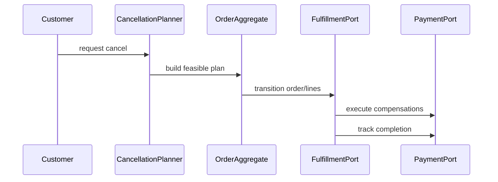

# Cancellation

## Vai trò trong hệ thống

**Cancellation** là capability chuyên biệt của **order management system**. Module chỉ sở hữu quyết định và dữ liệu cần thiết cho cancellation; nó không được biến thành service tổng hợp cho toàn platform. Input/output phải dùng ngôn ngữ nghiệp vụ, còn database, broker và provider được đặt sau port/adapter rõ ràng.

## Invariant cần bảo vệ

- Cancellation giữ trạng thái hợp lệ theo rule của order-management-system.
- Mỗi command có idempotency/correlation key và kết quả ổn định khi retry.
- Transition quan trọng ghi actor, timestamp, version và lý do thay đổi.
- Không cập nhật trực tiếp projection để “sửa số”; mọi correction đi qua command có audit.

## Thiết kế đề xuất

Cancellation planner đánh giá từng line theo fulfillment state, policy và payment status. Nó tạo plan gồm release allocation, stop shipment và refund; executor idempotent theo cancellation id.

## Failure modes riêng của module

- Cancel cạnh tranh với shipment/capture.
- Refund/void thành công nhưng order chưa chuyển state.
- Partial cancellation tính sai quantity còn lại.

## Chiến lược kiểm thử

1. Transition table cho pending/paid/shipped và partial quantities.
2. Concurrency test cancel vs fulfill.
3. Idempotency/reconciliation test refund + state update.

## Observability

Theo dõi **stuck cancellation age, refund mismatch, cancel-fulfill conflict**. Log/trace phải có order ID, correlation ID, command/event type và aggregate version; alert ưu tiên business age/mismatch thay vì exception count đơn thuần.

## Runbook

1. Đóng cancel mới cho order cohort bị ảnh hưởng.
2. Xác định shipment/payment source of truth và quantity cuối.
3. Replay compensation idempotently hoặc chuyển manual review.
4. Verify order, refund và inventory cùng nhất quán trước khi đóng incident.

## Câu hỏi design review

- Transaction boundary có đúng với invariant “Cancellation giữ trạng thái hợp lệ theo rule của order-management-system” không?
- Duplicate, stale version và out-of-order event được xử lý bằng semantics nào?
- Có đường reconcile khi dependency thành công nhưng response bị mất không?
- Metric **cancellation error rate; pending age; business impact** có phát hiện sai lệch trước khi khách hàng báo không?
- Runbook có thao tác an toàn, idempotent và có verification query không?

## Phạm vi tài liệu

Bài này mô tả **hủy order ở cấp OMS**: xác định line nào còn hủy được, phối hợp allocation/fulfillment/refund và giữ audit trail của quyết định. Nó không xử lý việc giải phóng một time slot như Booking Cancellation; trọng tâm là partial cancellation, shipment race và compensation giữa các capability của Order Management.