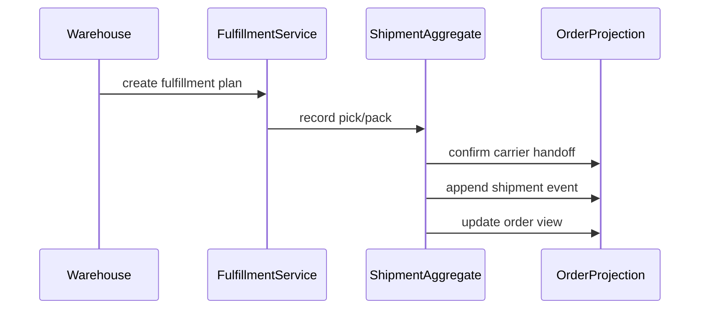
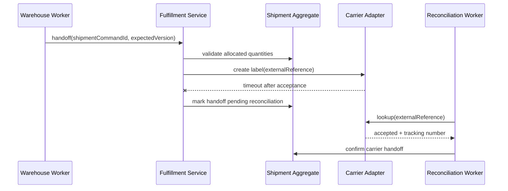

# Fulfillment

## Vai trò trong hệ thống

**Fulfillment** là capability chuyên biệt của **order management system**. Module chỉ sở hữu quyết định và dữ liệu cần thiết cho fulfillment; nó không được biến thành service tổng hợp cho toàn platform. Input/output phải dùng ngôn ngữ nghiệp vụ, còn database, broker và provider được đặt sau port/adapter rõ ràng.

## Invariant cần bảo vệ

- Fulfillment giữ trạng thái hợp lệ theo rule của order-management-system.
- Mỗi command có idempotency/correlation key và kết quả ổn định khi retry.
- Transition quan trọng ghi actor, timestamp, version và lý do thay đổi.
- Không cập nhật trực tiếp projection để “sửa số”; mọi correction đi qua command có audit.

## Thiết kế đề xuất

Fulfillment aggregate quản lý shipment/package lifecycle riêng với order. Pick/pack/ship events cập nhật line quantities; partial shipment được phản ánh bằng projection thay vì ép order thành một trạng thái đơn.

## Failure modes riêng của module

- Ship command lặp tạo hai shipment.
- Carrier accepted nhưng tracking chưa persist.
- Shipped quantity vượt allocated quantity.

## Chiến lược kiểm thử

1. Idempotency test theo shipment command/reference.
2. Failure injection sau carrier success trước local commit.
3. Property test shipped <= allocated <= ordered.

## Observability

Theo dõi **duplicate shipment, fulfillment lag, tracking reconciliation gap**. Log/trace phải có order ID, correlation ID, command/event type và aggregate version; alert ưu tiên business age/mismatch thay vì exception count đơn thuần.

## Runbook

1. Tạm dừng dispatch cho warehouse/carrier liên quan.
2. Tra cứu carrier bằng external reference trước khi retry.
3. Backfill shipment/tracking hoặc void duplicate label.
4. Reconcile quantity và audit mọi correction.

## Câu hỏi design review

- Transaction boundary có đúng với invariant “Fulfillment giữ trạng thái hợp lệ theo rule của order-management-system” không?
- Duplicate, stale version và out-of-order event được xử lý bằng semantics nào?
- Có đường reconcile khi dependency thành công nhưng response bị mất không?
- Metric **fulfillment error rate; pending age; business impact** có phát hiện sai lệch trước khi khách hàng báo không?
- Runbook có thao tác an toàn, idempotent và có verification query không?

## Phạm vi tài liệu

Tài liệu này tập trung riêng vào **Fulfillment** trong `production/order-management-system/modules/fulfillment.md`: ownership, invariant, failure recovery và evidence vận hành. Overview của platform mô tả quan hệ giữa các capability; bài này là contract review cho module và không thay thế runbook triển khai cụ thể của môi trường.

## Mô hình dữ liệu và ownership

`ShipmentAggregate` sở hữu package, shipped quantity, carrier reference và transition pick/pack/ship. `OrderProjection` chỉ tổng hợp trạng thái hiển thị; nó không được dùng để quyết định quantity có thể ship. Warehouse command phải mang `shipmentCommandId`, expected version và line quantities để chống duplicate và stale write.

## Sequence khi carrier outcome mơ hồ

## Evidence phát hành

- Contract test cho carrier adapter với accepted, rejected và timeout-after-acceptance.
- Concurrency test chứng minh `shipped <= allocated` khi hai worker cùng thao tác.
- Dashboard có oldest pending reconciliation, duplicate label count và fulfillment lead time theo warehouse.
- Runbook chứa truy vấn carrier bằng external reference trước mọi retry tạo label.

## Quy tắc package và partial fulfillment

Một order line có thể được chia qua nhiều package, nhưng tổng `picked`, `packed` và `shipped` theo line không được vượt quantity đã allocate. Package có lifecycle riêng vì carrier label, tracking và handoff thay đổi độc lập. Order chỉ nhận event tóm tắt fulfillment; nó không sở hữu chi tiết scan của warehouse.

Khi warehouse thiếu hàng sau allocation, module không tự giảm order quantity. Nó phát `FulfillmentShortageDetected` kèm line, quantity và reason để process manager quyết định backorder, substitution hoặc cancellation. Cách này giữ quyền quyết định customer promise ở OMS thay vì đẩy vào adapter warehouse.

### Contract với carrier

Carrier adapter phải cung cấp external reference ổn định và lookup API. Nếu create-label timeout, fulfillment ghi trạng thái `handoff_pending` cùng reference rồi reconciliation worker lookup trước khi thử lại. Lỗi validation như địa chỉ không hợp lệ là permanent; lỗi 503 là transient; timeout sau gửi là ambiguous.

### Test matrix

| Scenario | Kỳ vọng |
|---|---|
| Hai worker ship cùng command id | Chỉ một shipment event |
| Shipped vượt allocated | Reject trước carrier call |
| Carrier accepted nhưng timeout | Pending reconciliation, không tạo label mới |
| Tracking update đến trước handoff confirm | Buffer hoặc bỏ qua theo version có audit |
| Partial shipment | Projection hiển thị đúng shipped/remaining |
