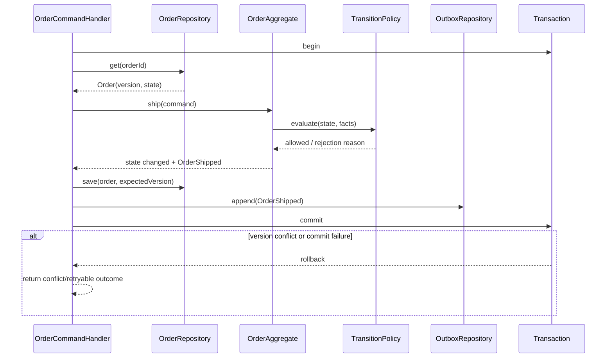

# Order State

## Vai trò trong hệ thống

**Order State** là capability chuyên biệt của **order management system**. Module chỉ sở hữu quyết định và dữ liệu cần thiết cho order state; nó không được biến thành service tổng hợp cho toàn platform. Input/output phải dùng ngôn ngữ nghiệp vụ, còn database, broker và provider được đặt sau port/adapter rõ ràng.

## Invariant cần bảo vệ

- Order State giữ trạng thái hợp lệ theo rule của order-management-system.
- Mỗi command có idempotency/correlation key và kết quả ổn định khi retry.
- Transition quan trọng ghi actor, timestamp, version và lý do thay đổi.
- Không cập nhật trực tiếp projection để “sửa số”; mọi correction đi qua command có audit.

## Thiết kế đề xuất

Order aggregate sở hữu state và transition guard. Application handler mở transaction, load aggregate theo version, gọi hành vi nghiệp vụ, lưu aggregate rồi ghi domain event/outbox trong cùng commit. `TransitionPolicy` chỉ cung cấp rule nếu rule dùng chung; policy không tự ghi repository hoặc publish event.

Thiết kế tách rõ ba trách nhiệm: aggregate bảo vệ lifecycle, repository bảo vệ optimistic concurrency và outbox bảo đảm event chỉ tồn tại khi state đã commit. Projection cập nhật bất đồng bộ và có thể rebuild từ source of truth.

## Failure modes riêng của module

- Illegal transition do stale version.
- Event đến trễ kéo read model về state cũ.
- Side effect chạy trước khi transition commit.

## Chiến lược kiểm thử

1. Exhaustive transition-table test.
2. Optimistic-lock conflict test.
3. Out-of-order event projection test.

## Observability

Theo dõi **illegal transition count, stale-version conflict, projection lag**. Log/trace phải có order ID, correlation ID, command/event type và aggregate version; alert ưu tiên business age/mismatch thay vì exception count đơn thuần.

## Runbook

1. Khoanh vùng order/version và event offset.
2. Giữ aggregate source of truth; rebuild projection nếu cần.
3. Không replay side effect trước khi kiểm tra idempotency.
4. Thêm guard/transition test cho đường gây sự cố.

## Câu hỏi design review

- Aggregate version được kiểm tra tại load/save hay chỉ dựa vào read model?
- Transition guard nào phụ thuộc payment, allocation hoặc fulfillment fact; fact đó có version/timestamp không?
- Domain event được ghi cùng transaction với state hay có cửa sổ mất event?
- Projection bỏ qua event cũ bằng aggregate version/offset như thế nào?
- Illegal transition tăng đột biến sẽ được điều tra bằng order ID, command type và expected/current state ra sao?
- Runbook rebuild projection có bảo đảm không replay payment/shipping side effect không?

## Phạm vi tài liệu

Tài liệu này tập trung riêng vào **Order State** trong `production/order-management-system/modules/order-state.md`: ownership, invariant, failure recovery và evidence vận hành. Overview của platform mô tả quan hệ giữa các capability; bài này là contract review cho module và không thay thế runbook triển khai cụ thể của môi trường.
