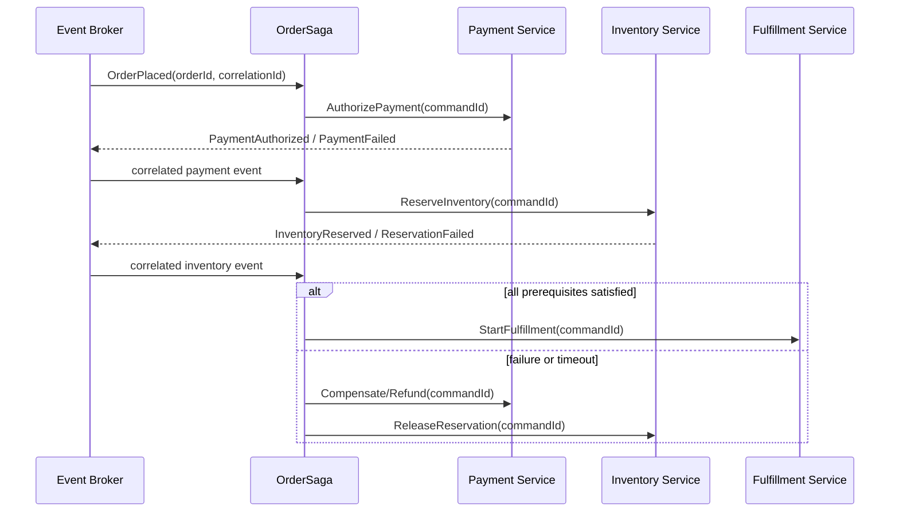

# Saga

## Vai trò trong hệ thống

**Saga** là capability chuyên biệt của **order management system**. Module chỉ sở hữu quyết định và dữ liệu cần thiết cho saga; nó không được biến thành service tổng hợp cho toàn platform. Input/output phải dùng ngôn ngữ nghiệp vụ, còn database, broker và provider được đặt sau port/adapter rõ ràng.

## Invariant cần bảo vệ

- Saga giữ trạng thái hợp lệ theo rule của order-management-system.
- Mỗi command có idempotency/correlation key và kết quả ổn định khi retry.
- Transition quan trọng ghi actor, timestamp, version và lý do thay đổi.
- Không cập nhật trực tiếp projection để “sửa số”; mọi correction đi qua command có audit.

## Thiết kế đề xuất

Saga/process manager lưu state của workflow dài: payment, allocation, fulfillment. Mỗi incoming event được deduplicate; timeout tạo command bù, và manual intervention khi không thể tự động khôi phục.

## Failure modes riêng của module

- Saga stuck giữa payment và inventory.
- Compensation chạy lặp hoặc sai thứ tự.
- Message duplicate/out-of-order làm state machine tiến sai.

## Chiến lược kiểm thử

1. State-machine test cho mọi step/compensation.
2. Duplicate/out-of-order message test.
3. Timeout và operator-resume integration test.

## Observability

Theo dõi **saga stuck age, compensation failure, step retry count**. Log/trace phải có order ID, correlation ID, command/event type và aggregate version; alert ưu tiên business age/mismatch thay vì exception count đơn thuần.

## Runbook

1. Pause saga type/version nếu lỗi hệ thống.
2. Đọc saga log để xác định step đã commit ở từng service.
3. Replay hoặc compensate bằng command idempotent.
4. Đưa case mơ hồ vào manual review và ghi resolution event.

## Câu hỏi design review

- Transaction boundary có đúng với invariant “Saga giữ trạng thái hợp lệ theo rule của order-management-system” không?
- Duplicate, stale version và out-of-order event được xử lý bằng semantics nào?
- Có đường reconcile khi dependency thành công nhưng response bị mất không?
- Metric **saga error rate; pending age; business impact** có phát hiện sai lệch trước khi khách hàng báo không?
- Runbook có thao tác an toàn, idempotent và có verification query không?

## Phạm vi tài liệu

Tài liệu này tập trung riêng vào **Saga** trong `production/order-management-system/modules/saga.md`: ownership, invariant, failure recovery và evidence vận hành. Overview của platform mô tả quan hệ giữa các capability; bài này là contract review cho module và không thay thế runbook triển khai cụ thể của môi trường.
