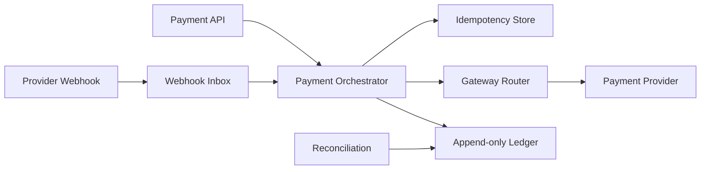

# Payment Platform

## Phạm vi

Case study này mô tả cách thiết kế và vận hành miền **payment** ở production. Trọng tâm không phải chia bao nhiêu service, mà là xác định source of truth, invariant, transaction boundary, failure recovery và evidence vận hành.

## Source of truth

**PaymentIntent / Ledger** là trung tâm của thiết kế. Read model, cache hoặc provider status chỉ là projection/evidence; không được âm thầm thay thế source of truth.

## Invariant xuyên hệ thống

Không charge hai lần; ledger cân bằng; refund không vượt captured amount.

## Bản đồ capability

## Failure model

Các tình huống bắt buộc có test hoặc tabletop exercise:

- Gateway timeout sau provider success.
- duplicate webhook.
- lệch settlement.
- chargeback và refund race.

Với **Payment Platform**, mỗi failure phải gắn với signal phát hiện đúng invariant, biện pháp containment giới hạn blast radius, recovery procedure, owner ra quyết định và evidence xác nhận dữ liệu/nghiệp vụ đã trở lại trạng thái hợp lệ.

## Modules

- [Gateway Routing](modules/gateway-routing.md)
- [Idempotency](modules/idempotency.md)
- [Ledger](modules/ledger.md)
- [Reconciliation](modules/reconciliation.md)
- [Refund](modules/refund.md)
- [Webhook Inbox](modules/webhook-inbox.md)

## Cách học

1. Theo dõi một PaymentIntent từ API đến provider webhook và ledger entry.
2. Vẽ riêng authorization, capture, refund và chargeback transition.
3. Mô phỏng timeout sau provider success; quyết định retry hay reconcile.
4. Đối chiếu provider settlement với internal ledger và ghi exception workflow.
5. Viết ADR cho idempotency key ownership hoặc gateway routing.

## Test strategy

- Property test debit/credit luôn cân bằng.
- Contract test chuẩn hóa status/error của từng PSP.
- Integration test unique idempotency key và atomic ledger append.
- Failure test duplicate webhook, late success và concurrent refund.
- Reconciliation test phát hiện missing/extra settlement record.

## Observability

Theo dõi tối thiểu: **Authorization success rate, duplicate prevention, reconciliation exception age, ledger imbalance = 0**. Dashboard phải cho phép drill-down từ metric → business identifier → state transition → log/event → runbook.

## Definition of Done

- Không có duplicate charge với cùng intent/key.
- Ledger balance và refund limit được test.
- Webhook inbox có deduplication và replay.
- Reconciliation exception có owner/SLA.
- Runbook xử lý provider timeout và settlement mismatch.

## Enterprise operating model

- **Authoritative state:** PaymentIntent + append-only Ledger. Mọi projection hoặc provider response phải truy ngược được về business identifier và version của state này.
- **Lifecycle cần mô hình hóa:** authorization/capture/refund/chargeback. Transition không hợp lệ phải bị từ chối bằng reason có thể support/debug.
- **Failure rehearsal bắt buộc:** provider timeout after success. Tabletop exercise phải chỉ ra detection, containment, recovery, owner và evidence đóng incident.
- **Signals tối thiểu:** ledger imbalance, reconciliation age, duplicate prevention. Alert phải gắn với customer impact hoặc invariant, không chỉ CPU/log volume.

### Release packet

Rollout gateway/routing mới phải có shadow authorization hoặc canary theo merchant, giới hạn amount, reconciliation query và kill switch. Rollback chỉ được đóng khi không còn intent ở trạng thái ambiguous và ledger/provider settlement đã đối chiếu.
