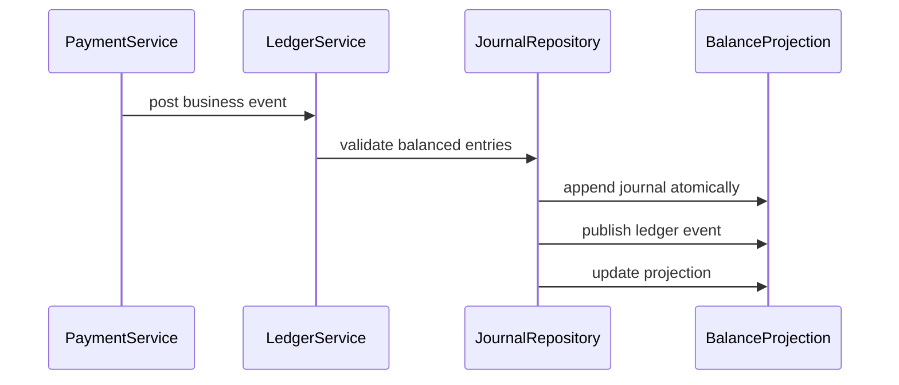

# Ledger

## Vai trò trong hệ thống

**Ledger** là capability chuyên biệt của **payment platform**. Module chỉ sở hữu quyết định và dữ liệu cần thiết cho ledger; nó không được biến thành service tổng hợp cho toàn platform. Input/output phải dùng ngôn ngữ nghiệp vụ, còn database, broker và provider được đặt sau port/adapter rõ ràng.

## Invariant cần bảo vệ

- **Mọi movement cân bằng và không sửa lịch sử đã post.**
- Mọi command có actor/correlation ID và chỉ được áp dụng một lần theo semantics của module.
- State transition phải kiểm tra precondition/version trước side effect bên ngoài.
- Correction không sửa projection trực tiếp; phải đi qua command hoặc reconciliation có audit.
- Tenant/currency/timezone/resource scope không được suy đoán ngầm.

## Thiết kế đề xuất

Dùng double-entry ledger append-only. Mỗi nghiệp vụ tạo một journal cân bằng debit/credit; số dư là projection có thể tái dựng, còn reversal tạo bút toán đối ứng thay vì sửa lịch sử.

## Failure modes riêng của module

- unbalanced entry; duplicate posting; reversal trỏ sai entry.
- Dependency có thể thành công nhưng response/ack bị mất, vì vậy retry mù có thể nhân đôi side effect.
- Event có thể đến trễ, trùng hoặc sai thứ tự; consumer phải dùng version/idempotency để quyết định bỏ qua hay reconcile.
- Dữ liệu projection/cache có thể cũ hơn source of truth và không được dùng để thực hiện correction không kiểm chứng.

## Chiến lược kiểm thử

1. Property test: tổng debit bằng tổng credit cho mọi journal hợp lệ.
2. Posting test: cùng idempotency key không tạo entry lần hai.
3. Reversal test: correction tạo compensating entry, không sửa lịch sử.
4. Concurrency test: hai posting cạnh tranh không làm balance sai.
5. Rebuild test: balance projection khớp journal source of truth.

## Observability

Theo dõi **unbalanced entries, posting lag, reversal rate**. Log/trace tối thiểu gồm resource ID, tenant, correlation/idempotency key, command/event type, version và provider nếu có.

Dashboard của **ledger** trong payment platform phải hiển thị phạm vi ảnh hưởng, giá trị nghiệp vụ liên quan, tuổi của item lâu nhất và xu hướng backlog. Alert ưu tiên breach của invariant hoặc SLA riêng của ledger; exception count chỉ là tín hiệu chẩn đoán phụ.

## Runbook

1. Xác định phạm vi ảnh hưởng theo resource/tenant/time window và dừng automation có thể làm sai lệch tăng thêm.
2. Xác minh source of truth, transition cuối cùng đã commit và side effect bên ngoài có thực sự xảy ra hay chưa.
3. Dừng posting, đối chiếu journal theo correlation id, tạo compensating entry có audit.
4. Chạy verification query/contract check; mọi correction phải có actor, lý do và correlation ID.
5. Chỉ mở lại traffic/worker khi backlog, error rate và oldest pending age giảm ổn định.
6. Viết regression test hoặc guardrail tái hiện đúng failure vừa xảy ra.

## Câu hỏi design review

- Journal có bất biến double-entry tại đúng transaction boundary không?
- Currency/rounding và account ownership được kiểm soát ở type nào?
- Reversal có giữ audit trail và liên kết entry gốc không?
- Metric imbalance/posting lag có dẫn tới verification query cụ thể không?

## Phạm vi tài liệu

Tài liệu này tập trung riêng vào **Ledger** trong `production/payment-platform/modules/ledger.md`: ownership, invariant, failure recovery và evidence vận hành. Overview của platform mô tả quan hệ giữa các capability; bài này là contract review cho module và không thay thế runbook triển khai cụ thể của môi trường.
