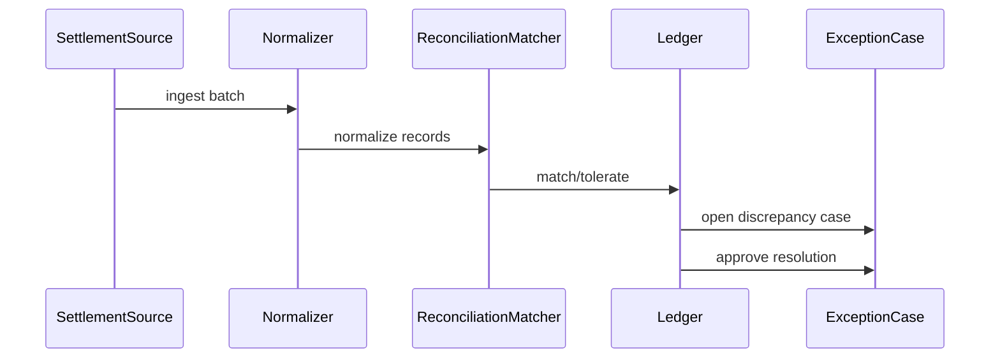

# Reconciliation

## Vai trò trong hệ thống

**Reconciliation** thuộc miền **payment** và chịu trách nhiệm cho một capability riêng, không phải service tổng hợp. **Reconciliation** là capability chuyên biệt trong **payment**. Boundary chỉ nhận input theo ngôn ngữ nghiệp vụ của reconciliation, bảo vệ invariant và phát result/event ổn định. Persistence, broker, scheduler hoặc provider phải nằm sau port/adapter; module không được trở thành service tổng hợp cho toàn platform.

## Invariant cần bảo vệ

- mọi giao dịch nội bộ ghép được với bằng chứng provider.
- Mỗi command có idempotency/correlation key và kết quả ổn định khi retry.
- Transition quan trọng ghi actor, timestamp, version và lý do thay đổi.
- Không cập nhật trực tiếp projection để “sửa số”; mọi correction đi qua command có audit.

## Thiết kế đề xuất

Thiết kế pipeline bốn bước: ingest settlement immutable, normalize theo provider, match với internal ledger và quản lý exception. Re-run phải idempotent và mọi manual resolution cần audit.

## Failure modes riêng của module

- missing settlement;
-  amount mismatch;
-  duplicate record.
- Response bị mất sau khi side effect đã commit, khiến caller không biết nên retry hay reconcile.
- Event đến trễ hoặc sai thứ tự làm projection khác source of truth.

## Chiến lược kiểm thử

1. End-to-end test ingest settlement file, normalize row, match payment, tạo discrepancy và đóng exception bằng evidence có audit actor.
2. State-transition test cho happy path, invalid transition và stale version.
3. Idempotency test: cùng key/cùng payload trả cùng result; cùng key/khác payload bị từ chối.
4. Integration test transaction + outbox/inbox nếu module vừa đổi state vừa publish event.
5. Concurrency/failure-injection test ở trước commit, sau commit và khi dependency timeout.
6. Reconciliation test chứng minh projection có thể rebuild từ source of truth.

## Observability

Theo dõi **unmatched count; unmatched amount; oldest unmatched age**. Mọi log/trace phải có resource ID, correlation ID, command type và version. Alert nên dựa trên business impact và age của item chưa hoàn tất; exception count đơn thuần không đủ phân biệt sự cố với retry bình thường.

## Runbook

1. Xác định source of truth và transition cuối cùng đã commit.
2. Khoanh vùng theo resource ID, correlation ID, idempotency key và version.
3. Tạm dừng worker/retry nếu chúng có thể làm sai lệch tăng thêm.
4. đóng băng auto-settlement, phân loại mismatch rồi replay theo batch.
5. Chạy verification query, ghi audit cho mọi correction và chỉ mở lại traffic khi metric trở về ngưỡng an toàn.
6. Bổ sung test/guardrail cho failure vừa xảy ra.

## Câu hỏi design review

- Quy trình operator xử lý unmatched/partial/refund row ra sao và ledger correction có dùng reversal thay vì update lịch sử không?
- Duplicate, stale version và out-of-order event được xử lý bằng semantics nào?
- Có đường reconcile khi dependency thành công nhưng response bị mất không?
- Metric **unmatched count; unmatched amount; oldest unmatched age** có phát hiện sai lệch trước khi khách hàng báo không?
- Runbook có thao tác an toàn, idempotent và có verification query không?

## Phạm vi tài liệu

Đây là **chuyên đề tình huống nâng cao** cho `production/payment/07-reconciliation.md`. Nội dung tập trung vào reconciliation ở boundary này, không thay thế overview của platform.
