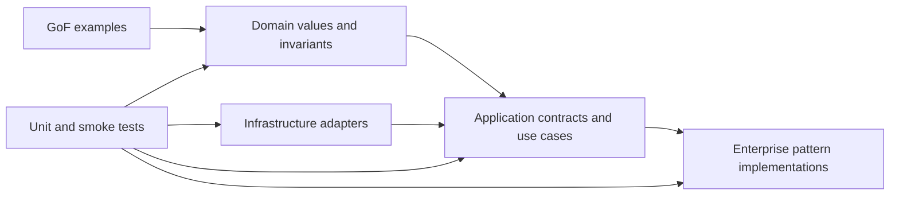

# Source Map — Mã mẫu có thể chạy và kiểm thử

`src/` chứa các implementation nhỏ, framework-independent, dùng để minh họa contract, dependency direction, failure semantics và testability. Đây **không phải** framework production hoàn chỉnh; mỗi implementation cố ý giới hạn scope để người học quan sát một quyết định thiết kế.



## Bản đồ mã nguồn và evidence

| Khu vực | Nội dung | Evidence chính |
|---|---|---|
| `Domain/` | `Money`, `DomainEvent` | value semantics, currency mismatch, immutable event data |
| `Application/Command/` | command, handler, `CommandBus` | registration, dispatch, duplicate/missing handler |
| `Creational/Factory/` | exporter factory | product selection và unsupported format |
| `Structural/Adapter/` | legacy SMS adapter | request mapping, stable contract và error boundary |
| `Structural/Decorator/` | validating message sender | validation, delegation và wrapper behavior |
| `Behavioral/Strategy/` | payment policy | strategy substitution và amount delegation |
| `Behavioral/Observer/` | synchronous event dispatcher | event routing và subscriber invocation |
| `Behavioral/State/` | order lifecycle | valid/invalid transition |
| `Enterprise/Repository/` | customer collection semantics | save/get/filter và missing aggregate |
| `Enterprise/Resilience/` | retry, circuit breaker, bulkhead và rate limiter | retry budget, dependency health, capacity isolation, request budget và reconciliation |
| `Enterprise/ServiceLayer/` | customer registration use case | orchestration và duplicate identity |
| `Enterprise/Query/` | criteria-based read query | filtering behavior và empty criteria |
| `Enterprise/Specification/` | composable rule | AND semantics và short-circuit expectation |
| `Enterprise/UnitOfWork/` | transaction boundary | commit, rollback và nested transaction |
| `Enterprise/DataMapper/` | entity ↔ row mapping | domain independence khỏi persistence |
| `Enterprise/ActiveRecord/` | persistence-coupled note | CRUD convenience và coupling trade-off |
| `Infrastructure/Clock/` | system clock port/adapter | time abstraction và type contract |
| `Infrastructure/Idempotency/` | deduplication record/store | replay và payload conflict |
| `Infrastructure/Outbox/` | pending/published messages | lifecycle, ordering và duplicate-safe publish boundary |
| `ReadModel/` | immutable page | cursor/pagination semantics |

## Dependency rules

- Domain không import framework hoặc infrastructure namespace.
- Application phụ thuộc contract, không phụ thuộc concrete adapter.
- Infrastructure triển khai port và translate lỗi kỹ thuật tại boundary.
- Enterprise example chỉ đưa abstraction vào nơi semantics cần được bảo vệ.
- Test được phép phụ thuộc concrete class; production client nên phụ thuộc contract khi có thay đổi thực sự.

## Quy ước mã nguồn

- Mọi file PHP dùng `declare(strict_types=1)`.
- Namespace và PSR-4 path phải khớp.
- Constructor bảo vệ invariant cần thiết; không trì hoãn lỗi sang thời điểm ngẫu nhiên.
- Exception message mô tả contract/invariant bị vi phạm.
- In-memory implementation chỉ phục vụ test/demo và phải ghi rõ limitation.
- Collection có PHPDoc khi PHP chưa hỗ trợ generic.
- Không thêm interface “để phòng tương lai” nếu chưa có boundary hoặc test seam.

## Cách kiểm tra

```bash
composer source-smoke
composer test
composer analyse
```

Smoke test không cần vendor dependencies và xác nhận các flow tích hợp nhỏ. PHPUnit kiểm tra behavior chi tiết; PHPStan kiểm tra type contract. Khi thay đổi source, phải chạy cả ba lớp ở môi trường đầy đủ.

## Quy trình thêm implementation mới

1. Liên kết implementation với một bài học và một vấn đề cụ thể.
2. Viết contract hoặc invariant trước code.
3. Viết happy-path test và ít nhất một failure-path test.
4. Thêm smoke scenario nếu component tham gia flow nhiều object.
5. Cập nhật bảng source map và link từ bài viết.
6. Ghi rõ giới hạn, đặc biệt với synchronous/in-memory implementation.
7. Không thêm code chỉ để “phủ đủ pattern”.

## Review packet cho source

Reviewer cần trả lời được:

- Object nào sở hữu invariant?
- Dependency hướng vào policy hay hướng vào technology?
- Failure được translate ở đâu?
- Test nào chứng minh behavior thay vì implementation detail?
- Có giải pháp trực tiếp nào đơn giản hơn không?
- Khi chuyển sang database/queue/provider thật, semantics nào phải giữ nguyên?

## Các giới hạn có chủ đích

`CommandBus` và `EventDispatcher` là synchronous in-memory implementation. Chúng không có middleware, queue, retry, transaction hoặc observability. `InMemoryUnitOfWork`, repository, idempotency store và outbox không mô phỏng isolation/durability của database. Những concern này được trình bày trong production docs và labs thay vì che giấu trong mã mẫu nhỏ.

## Resilience policy có thể chạy

`Enterprise/Resilience/` minh họa cách tách phân loại failure khỏi cơ chế retry. `RetryPolicy` phân biệt transient, permanent và ambiguous outcome; chỉ retry transient operation khi side effect idempotent và còn retry budget. Ambiguous outcome chuyển sang reconciliation để tránh lặp charge hoặc tạo duplicate booking. Unit test và source smoke xác minh ba nhánh quyết định này.

## Resilience example

`src/Enterprise/Resilience` hiện minh họa ba quyết định khác nhau:

- `RetryPolicy`: phân loại transient, permanent và ambiguous outcome.
- `CircuitBreaker`: ngăn gọi dependency đang lỗi và kiểm soát half-open probe.
- `FailureKind`/`RetryDecision`: contract giúp application layer quyết định retry hoặc reconciliation mà không phụ thuộc exception vendor.

Source nhỏ có chủ đích. Khi đưa vào production, cần bổ sung clock port, metrics, sliding window, scope theo tenant/provider và test concurrent half-open probe.

## Capacity isolation có thể chạy

`Bulkhead` minh họa admission control theo số execution đồng thời. Invariant chính là active count không vượt capacity và permit luôn được trả lại trong `finally`, kể cả khi dependency ném exception. Unit test chứng minh success, failure và rejection khi capacity cạn. Production cần metric saturation/rejection, timeout khi chờ permit và permit pool tách theo blast radius.

## Distributed resilience, testing và migration

| Khu vực | Mục đích | Evidence |
|---|---|---|
| `Enterprise/Resilience/DistributedBulkhead/` | lease, capacity và expiry semantics | unit test + source smoke |
| `Enterprise/Testing/` | deterministic failure checkpoint | unit test + failure-injection lab |
| `Enterprise/Migration/` | authoritative/shadow comparison | unit test + migration rehearsal |

`InMemoryPermitStore` không phải distributed coordination thật. Production adapter cần atomic acquire/release, server-side time, lease/fencing strategy và saturation metrics. `FailureInjector` chỉ dùng trong test hoặc game day có guardrail. `DualRunComparator` yêu cầu shadow path không tạo side effect authoritative.

### Messaging Deduplication

`Enterprise/Messaging/DeduplicationWindow` minh họa deduplication có TTL cho consumer nhận delivery at-least-once. Contract cố ý nhỏ: message ID chỉ được chấp nhận lần đầu trong cửa sổ; hết TTL có thể được nhận lại. Production adapter cần shared/atomic store, namespace theo consumer và telemetry cho duplicate/expiry. Test nằm tại `tests/Unit/Enterprise/Messaging/DeduplicationWindowTest.php`.


### Rate limiting và admission control

`Enterprise/Resilience/RateLimiter/FixedWindowRateLimiter` minh họa budget theo key và cửa sổ thời gian với clock truyền vào để test deterministic. Contract trả `allowed`, `remaining` và `retryAfterSeconds`; client không phụ thuộc storage. Unit test và source smoke kiểm tra tenant isolation, budget exhaustion và window reset. Đây là teaching implementation một process; production adapter cần atomic counter/TTL, server-side time, metric rejection và policy fail-open/fail-closed rõ ràng.

### Backpressure và Bounded Work Queue

`Enterprise/Resilience/Backpressure/BoundedWorkQueue` minh họa admission control dựa trên backlog thay vì request rate. Invariant là queue không vượt capacity; khi đầy, producer nhận `EnqueueDecision` có lý do `capacity_exhausted` thay vì tiếp tục tăng memory. Unit test kiểm tra rejection, capacity recovery và input validation. Production cần durable broker, visibility timeout/ack semantics, fairness theo tenant, metric queue age và runbook drain/replay.
