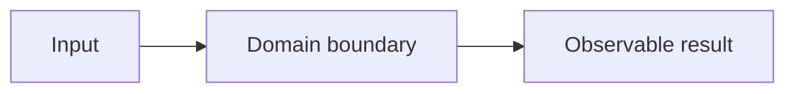

# Lab: Tên bài tập

## Bối cảnh nghiệp vụ

Nêu hệ thống, actor, dữ liệu, source of truth và lý do bài tập tồn tại.

## Mục tiêu học tập

Liệt kê năng lực quan sát được sau lab, không chỉ “hiểu pattern”.

## Kiến thức đầu vào

- Chủ đề cần đọc.
- Lệnh cần biết.
- Thời lượng dự kiến.

## Hệ thống ban đầu

Mô tả starter code, code smell và behavior đang được bảo vệ.

## Invariant và failure model

| Loại | Nội dung | Evidence |
|---|---|---|
| Invariant | Điều luôn phải đúng | Test/metric |
| Failure | Lỗi bắt buộc mô phỏng | Expected outcome |

## Sơ đồ mục tiêu

Thay sơ đồ mẫu bằng flow thật của lab.

## Yêu cầu chức năng

## Ràng buộc thiết kế

## Starter code

## Nhiệm vụ từng bước

1. Viết characterization test.
2. Xác định seam.
3. Refactor nhỏ.
4. Thêm failure test.
5. Ghi trade-off.

## Tiêu chí chấp nhận

## Test bắt buộc

## Gợi ý

Gợi ý theo mức, không tiết lộ toàn bộ lời giải ngay.

## Lời giải tham khảo

Link tới solution và giải thích cách đối chiếu.

## Production hardening

Idempotency, concurrency, observability, migration hoặc rollback nếu phù hợp.

## Rubric

| Tiêu chí | Điểm |
|---|---:|
| Đúng behavior | 30 |
| Boundary và design | 25 |
| Test | 25 |
| Trade-off và trình bày | 20 |

## Retrospective

- Điều gì đơn giản hơn sau refactor?
- Chi phí mới là gì?
- Khi nào nên quay về baseline?
