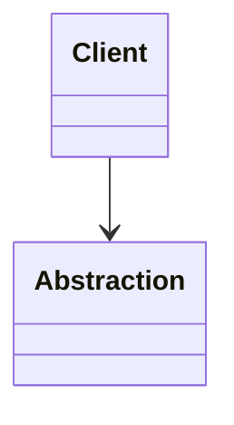

# Tên Pattern

> Một câu mô tả ngắn: pattern giải quyết lực thay đổi nào và đánh đổi điều gì.

## 1. Mục tiêu học tập

Sau bài này, người học phải có thể nhận diện code smell, giải thích intent, vẽ collaboration, refactor có safety net và nêu trường hợp không nên dùng.

## 2. Bối cảnh và vấn đề thực tế

Mô tả domain, code hiện tại, lực thay đổi, invariant và failure path. Tránh bắt đầu bằng định nghĩa học thuật.

## 3. Dấu hiệu nhận biết

- Code smell cụ thể.
- Thay đổi nào làm blast radius tăng.
- Evidence nào chứng minh đây là vấn đề thật.

## 4. Baseline đơn giản

Trình bày phương án trực tiếp trước khi đưa pattern vào. Giải thích khi baseline vẫn tốt hơn.

## 5. Intent và mental model

Giải thích bằng ngôn ngữ domain, participant và hướng phụ thuộc.

## 6. UML / sequence / state diagram

Thay sơ đồ mẫu bằng participant thật của bài.

## 7. Code trước refactor

Mã chạy được, tái hiện pain point tối thiểu và có characterization test.

## 8. Refactoring journey

1. Khóa behavior.
2. Xác định change axis.
3. Tạo seam nhỏ nhất.
4. Di chuyển một biến thể.
5. Kiểm chứng extension point.
6. Xóa đường cũ.

## 9. Code sau refactor

Mã chạy được, type rõ, exception semantics rõ và không chứa abstraction thừa.

## 10. Testing strategy

- Happy path và boundary.
- Contract test cho implementation.
- Failure path.
- Mutation/property test nếu phù hợp.

## 11. Khi nên dùng / không nên dùng

Nêu trigger, counter-example và cleanup condition.

## 12. Trade-off và chi phí vận hành

Bao gồm số abstraction, debugging, metrics, deployment, migration và rollback.

## 13. Sai lầm thường gặp

Liệt kê lỗi áp dụng đúng với pattern, không dùng checklist chung.

## 14. PHP / Laravel / Symfony

Chỉ ra framework wiring, lifecycle và boundary; không biến framework API thành định nghĩa pattern.

## 15. Case study production

Mô tả idempotency, concurrency, failure recovery, observability và runbook nếu pattern đi qua boundary production.

## 16. Bài tập có hướng dẫn

Có đề bài tự chứa, invariant, failure, deliverable, hints và tiêu chí chấm.

## 17. Câu hỏi phỏng vấn và đáp án

Mỗi câu có đáp án, trade-off và mẹo ghi điểm.

## 18. Pattern liên quan

So sánh intent, collaboration và dấu hiệu lựa chọn.

## 19. Tài liệu liên quan

Dùng link Markdown trực tiếp tới docs, example, exercise, ADR và source.
