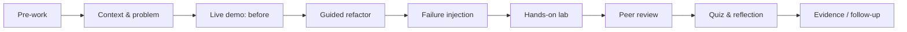

# Training by Level — Giáo trình đứng lớp

Thư mục này biến handbook thành chương trình đào tạo có thể sử dụng cho workshop nội bộ, onboarding và mentoring. Mỗi lesson có slide, speaker notes, demo chạy được, exercise, quiz và tiêu chí đánh giá.

## Kiến trúc một buổi học



## Tuyến học

| Level | Năng lực chính | Artifact tốt nghiệp |
|---|---|---|
| [01 — Foundations](level-01-foundations/README.md) | OOP collaboration, SOLID, refactoring safety | Refactor có characterization tests và rationale |
| [02 — Core Patterns](level-02-core-patterns/README.md) | Strategy, Factory, Adapter, Decorator, Observer, State | Mini-system có contract/failure tests |
| [03 — Enterprise](level-03-enterprise/README.md) | Repository, Query Object, Specification, UoW, Outbox | Use case có transaction boundary và read/write separation |
| [04 — Architecture](level-04-architecture/README.md) | Clean/Hexagonal, DDD, distributed consistency | Context map, ports/adapters và failure model |
| [05 — Tech Lead](level-05-tech-lead/README.md) | Design review, ADR, governance, release readiness | Review packet gồm ADR, evidence, rollout và runbook |

## Chuẩn bị cho giảng viên

1. Chạy `demo.php` trên môi trường sạch và chuẩn bị một lỗi có chủ đích.
2. Chọn một ví dụ gần domain của đội, nhưng giữ nguyên invariant của lesson.
3. Không trình bày code `after` ngay; để học viên dự đoán failure trước.
4. Chuẩn bị câu hỏi Socratic: “điều gì thay đổi?”, “ai sở hữu transaction?”, “nếu dependency timeout thì sao?”.
5. Chấm theo evidence và trade-off, không theo số pattern được sử dụng.

## Khung thời lượng 90 phút

| Phần | Thời lượng | Mục tiêu |
|---|---:|---|
| Context và failure story | 10 phút | Tạo động lực từ vấn đề thật |
| Mental model và diagram | 15 phút | Đồng bộ vocabulary |
| Live coding | 25 phút | Thấy refactoring journey |
| Failure injection | 10 phút | Kiểm tra semantics khi lỗi |
| Exercise nhóm | 20 phút | Tạo artifact review được |
| Debrief và quiz | 10 phút | Chốt trade-off và next step |

## Quy tắc tùy biến

- **Junior:** giảm số abstraction, tăng tracing bằng print/log và test case cụ thể.
- **Middle:** yêu cầu so sánh pattern với baseline và viết contract tests.
- **Senior:** thêm migration, concurrency, idempotency và observability.
- **Tech Lead:** yêu cầu ADR, rollout/rollback và review rubric.

## Definition of Done cho một lesson

- Demo chạy được từ clean checkout.
- Có happy path và ít nhất một failure path.
- Diagram khớp với code, không dùng participant generic.
- Exercise tạo artifact có thể review, không chỉ trả lời lý thuyết.
- Quiz có đáp án giải thích trade-off.
- Speaker notes chỉ ra misconception và câu hỏi follow-up.
- Người học nêu được khi **không nên** áp dụng pattern.

## Đánh giá sau khóa học

Thu thập evidence theo ba thời điểm:

- **Ngay sau buổi:** quiz, exercise và khả năng giải thích mental model.
- **Sau 1–2 tuần:** chất lượng PR/ADR sử dụng kỹ thuật đã học.
- **Sau 1 chu kỳ release:** số lỗi, thời gian review và khả năng rollback/operate.

## Lệnh kiểm tra

```bash
find training -name demo.php -print0 | xargs -0 -n1 php
composer learning-experience-audit
```

## Tài liệu liên quan

- [Learning Path](../learning-path/README.md)
- [Interviews](../interviews/README.md)
- [Training Roadmap](../docs/07-training/01-training-roadmap.md)
- [Assessment Rubric](../docs/07-training/04-assessment-rubric.md)
