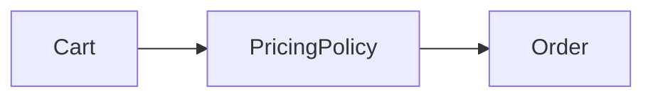

# Oop And Object Collaboration

## Bối cảnh thuyết trình

**Order checkout collaboration** là case xuyên suốt. Giảng viên bắt đầu bằng code hoặc flow trực tiếp, cho học viên dự đoán failure rồi mới giới thiệu vocabulary/pattern.

## Kết quả học tập

- Object ownership
- Tell, Don’t Ask
- Encapsulation
- Collaboration test
- Giải thích trade-off và chọn baseline đơn giản hơn khi pattern chưa cần thiết.
- Trình bày test, metric hoặc artifact chứng minh thiết kế hoạt động.

## Luồng hệ thống

## Agenda 90 phút

| Phút | Hoạt động | Evidence tạo ra |
|---:|---|---|
| 0–8 | Phân tích Cart tự tính discount, tax và persistence nên và chốt invariant | Một câu invariant có thể kiểm thử |
| 8–20 | Vẽ current flow và failure | Diagram có source of truth |
| 20–38 | Giải thích concept trọng tâm | collaboration diagram và object responsibility cards |
| 38–58 | Live coding theo safety net | Commit nhỏ, demo vẫn chạy |
| 58–73 | Failure injection | Log/output chứng minh behavior |
| 73–84 | Pair review và alternative | Trade-off note |
| 84–90 | Trình bày 3 phút | Decision + evidence + next step |
## Live coding

**Failure dùng để dẫn bài:** Cart tự tính discount, tax và persistence nên thay đổi một rule làm vỡ nhiều nơi

1. Xác định object nào sở hữu quantity, price và order total
2. Thay getter/setter flow bằng method biểu đạt intent
3. Viết test chứng minh Order không thể có total âm
4. Vẽ collaboration trước và sau
## Tiêu chí hoàn thành

- [ ] Xác định object nào sở hữu quantity, price và order total.
- [ ] Thay getter/setter flow bằng method biểu đạt intent.
- [ ] Viết test chứng minh Order không thể có total âm.
- [ ] Nhóm bàn giao collaboration diagram và object responsibility cards.
- [ ] Có câu trả lời cho trường hợp không áp dụng abstraction.
## Tài liệu lesson

- [Slides của bài Oop And Object Collaboration](slides.md): mạch trình bày và sơ đồ dùng khi đứng lớp.
- [Speaker notes](speaker-notes.md): câu hỏi dẫn dắt, lỗi học viên và điểm cần nhấn mạnh cho Oop And Object Collaboration.
- [Exercise](exercise.md): bài thực hành tạo evidence cho mục tiêu của lesson.
- [Quiz và đáp án](quiz.md): kiểm tra khả năng giải thích trade-off thay vì nhớ định nghĩa.
- Demo chạy được: `php demo.php` để quan sát luồng chính và failure case của Oop And Object Collaboration.
