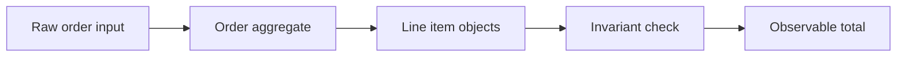

# Exercise — Oop And Object Collaboration

## Tình huống

Cart tự tính discount, tax và persistence nên thay đổi một rule làm vỡ nhiều nơi. Nhóm phải cải thiện thiết kế nhưng vẫn giữ behavior đã được xác nhận.

## Nhiệm vụ

1. Xác định object nào sở hữu quantity, price và order total
2. Thay getter/setter flow bằng method biểu đạt intent
3. Viết test chứng minh Order không thể có total âm
4. Vẽ collaboration trước và sau

## Failure bắt buộc

Tạo test hoặc script tái hiện: **Cart tự tính discount, tax và persistence nên thay đổi một rule làm vỡ nhiều nơi**. Lời giải không đạt nếu chỉ chạy happy path.

## Bàn giao

- collaboration diagram và object responsibility cards.
- Code/demo chạy được và tối thiểu một test failure path.
- Decision note ghi baseline, lựa chọn, trade-off và rollback.
- Trình bày 3 phút, trả lời: “khi nào giải pháp trực tiếp tốt hơn?”.

## Rubric riêng

| Tiêu chí | Điểm |
|---|---:|
| Bảo vệ đúng invariant của scenario | 25 |
| Ownership và dependency rõ | 20 |
| Failure được tái hiện và xử lý | 20 |
| Collaboration diagram và object responsibility cards có thể review | 15 |
| Alternative/trade-off trung thực | 10 |
| Giải thích mạch lạc | 10 |

## Full workshop flow

### Đề bài mở rộng

Tách xử lý đơn hàng đang thao tác trực tiếp array thành các object có trách nhiệm rõ.

### Invariant bắt buộc

Order phải giữ tổng tiền bằng tổng line item và không cho quantity âm.

### Luồng thực hiện

### Acceptance criteria riêng

Viết test construction, add item và invalid quantity; demo phải cho thấy message flow thay vì getter/setter thuần.

### Câu hỏi trình bày

- Object nào sở hữu invariant tổng tiền?
- Message nào thay thế việc sửa array trực tiếp?
- Thiết kế có tránh data bag/anemic object không?
- Khi nào value object là quá mức cho bài này?
