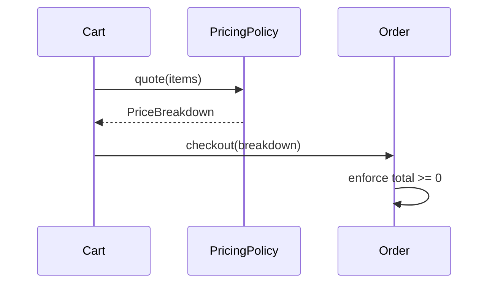

# Slides — Oop And Object Collaboration

## Slide 1 — Outcome

- Case: Order checkout collaboration
- Invariant nào phải giữ?
- Failure nào đáng sợ nhất?

## Slide 2 — Baseline

- Trình bày code/flow trực tiếp.
- Ưu điểm: ít abstraction, dễ trace.
- Điểm gãy: Object ownership.

## Slide 3 — Mental model

## Slide 4 — Concepts

- Object ownership
- Tell, Don’t Ask
- Encapsulation
- Collaboration test

## Slide 5 — Refactoring journey

1. Phân tách trách nhiệm giữa Order, PricingPolicy và PaymentPort.
2. Giữ invariant tiền tệ trong domain, không trong controller.
3. Dùng fake port để test collaboration không cần framework.

## Slide 6 — Failure demonstration

- Xóa validation khỏi object và quan sát invalid state lọt vào workflow.
- Khôi phục behavior method, chạy test invariant và so sánh collaboration trước/sau.
- Chỉ ra object nào sở hữu quyết định, object nào chỉ truyền dữ liệu.

## Slide 7 — Production checklist

- Phân tách trách nhiệm giữa Order, PricingPolicy và PaymentPort.
- Giữ invariant tiền tệ trong domain, không trong controller.
- Dùng fake port để test collaboration không cần framework.
- Thu thập evidence riêng cho **Order collaboration** trước khi rollout.

## Slide 8 — Alternatives và giới hạn

- Baseline đơn giản nhất cho **Order collaboration** là gì?
- Khi nào abstraction hiện tại nên được inline hoặc thay bằng decision table/workflow trực tiếp?
- Rủi ro nào không được pattern này giải quyết?

## Slide 9 — Exercise brief

Mở [exercise.md](exercise.md), xây artifact cho **Order collaboration** và chuẩn bị trình bày: invariant, sơ đồ ownership, failure rehearsal, test evidence và rollback/revisit condition.

## Slide 10 — Exit questions

- Khi entity chỉ còn getter/setter và service làm hết logic?
- Dependency nào đang bị giấu trong static helper?
- Evidence nào sẽ khiến bạn đổi quyết định cho **Order collaboration**?

