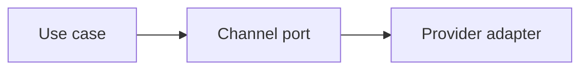

# Solid In Practice

## Bối cảnh thuyết trình

**Notification provider evolution** là case xuyên suốt. Giảng viên bắt đầu bằng code hoặc flow trực tiếp, cho học viên dự đoán failure rồi mới giới thiệu vocabulary/pattern.

## Kết quả học tập

- SRP theo reason to change
- OCP qua channel contract
- LSP semantics
- ISP theo client
- DIP tại boundary
- Giải thích trade-off và chọn baseline đơn giản hơn khi pattern chưa cần thiết.
- Trình bày test, metric hoặc artifact chứng minh thiết kế hoạt động.

## Luồng hệ thống

## Agenda 90 phút

| Phút | Hoạt động | Evidence tạo ra |
|---:|---|---|
| 0–8 | Phân tích Một NotificationService đổi vì template, prov và chốt invariant | Một câu invariant có thể kiểm thử |
| 8–20 | Vẽ current flow và failure | Diagram có source of truth |
| 20–38 | Giải thích concept trọng tâm | SOLID violation map và contract test matrix |
| 38–58 | Live coding theo safety net | Commit nhỏ, demo vẫn chạy |
| 58–73 | Failure injection | Log/output chứng minh behavior |
| 73–84 | Pair review và alternative | Trade-off note |
| 84–90 | Trình bày 3 phút | Decision + evidence + next step |
## Live coding

**Failure dùng để dẫn bài:** Một NotificationService đổi vì template, provider, retry và audit

1. Phân loại reason-to-change thay vì tách class theo cảm tính
2. Tạo channel contract với semantics gửi rõ ràng
3. Kiểm tra LSP bằng contract tests cho hai provider
4. Đưa wiring về composition root
## Tiêu chí hoàn thành

- [ ] Phân loại reason-to-change thay vì tách class theo cảm tính.
- [ ] Tạo channel contract với semantics gửi rõ ràng.
- [ ] Kiểm tra LSP bằng contract tests cho hai provider.
- [ ] Nhóm bàn giao SOLID violation map và contract test matrix.
- [ ] Có câu trả lời cho trường hợp không áp dụng abstraction.
## Tài liệu lesson

- [Slides của bài Solid In Practice](slides.md): mạch trình bày và sơ đồ dùng khi đứng lớp.
- [Speaker notes](speaker-notes.md): câu hỏi dẫn dắt, lỗi học viên và điểm cần nhấn mạnh cho Solid In Practice.
- [Exercise](exercise.md): bài thực hành tạo evidence cho mục tiêu của lesson.
- [Quiz và đáp án](quiz.md): kiểm tra khả năng giải thích trade-off thay vì nhớ định nghĩa.
- Demo chạy được: `php demo.php` để quan sát luồng chính và failure case của Solid In Practice.
