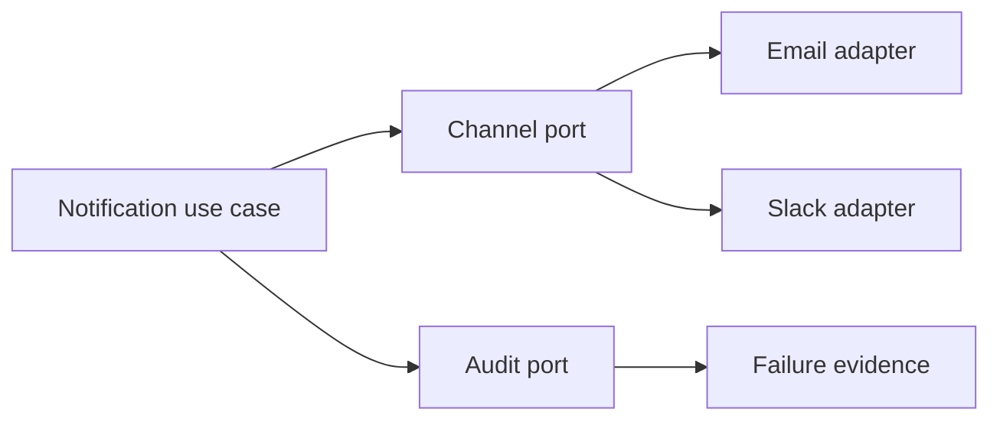

# Exercise — Solid In Practice

## Tình huống

Một NotificationService đổi vì template, provider, retry và audit. Nhóm phải cải thiện thiết kế nhưng vẫn giữ behavior đã được xác nhận.

## Nhiệm vụ

1. Phân loại reason-to-change thay vì tách class theo cảm tính
2. Tạo channel contract với semantics gửi rõ ràng
3. Kiểm tra LSP bằng contract tests cho hai provider
4. Đưa wiring về composition root

## Failure bắt buộc

Tạo test hoặc script tái hiện: **Một NotificationService đổi vì template, provider, retry và audit**. Lời giải không đạt nếu chỉ chạy happy path.

## Bàn giao

- SOLID violation map và contract test matrix.
- Code/demo chạy được và tối thiểu một test failure path.
- Decision note ghi baseline, lựa chọn, trade-off và rollback.
- Trình bày 3 phút, trả lời: “khi nào giải pháp trực tiếp tốt hơn?”.

## Rubric riêng

| Tiêu chí | Điểm |
|---|---:|
| Bảo vệ đúng invariant của scenario | 25 |
| Ownership và dependency rõ | 20 |
| Failure được tái hiện và xử lý | 20 |
| Solid violation map và contract test matrix có thể review | 15 |
| Alternative/trade-off trung thực | 10 |
| Giải thích mạch lạc | 10 |

## Full workshop flow

### Đề bài mở rộng

Refactor notification service phụ thuộc trực tiếp SMTP/Slack thành policy và ports vừa đủ.

### Invariant bắt buộc

Thêm kênh mới không sửa workflow hiện hữu; lỗi một channel không làm mất audit.

### Luồng thực hiện

### Acceptance criteria riêng

So sánh baseline với abstraction, viết contract test và chỉ ra nguyên tắc SOLID nào thực sự tạo giá trị.

### Câu hỏi trình bày

- Dependency nào thật sự cần đảo chiều?
- Interface nào có semantic contract thay vì chỉ một method?
- Failure của channel được cô lập hay lan sang workflow?
- Nguyên tắc SOLID nào không cần áp dụng thêm?
