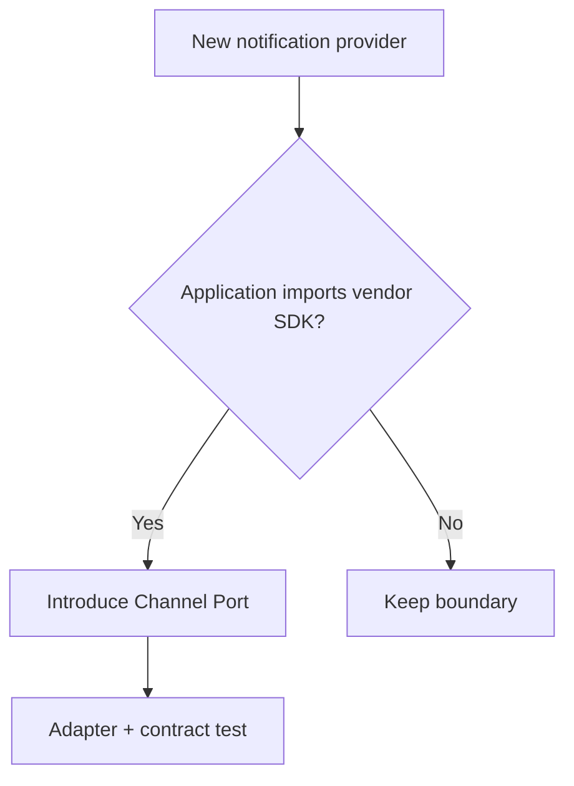

# Slides — Solid In Practice

## Slide 1 — Outcome

- Case: Notification provider evolution
- Invariant nào phải giữ?
- Failure nào đáng sợ nhất?

## Slide 2 — Baseline

- Trình bày code/flow trực tiếp.
- Ưu điểm: ít abstraction, dễ trace.
- Điểm gãy: SRP theo reason to change.

## Slide 3 — Mental model

## Slide 4 — Concepts

- SRP theo reason to change
- OCP qua channel contract
- LSP semantics
- ISP theo client
- DIP tại boundary

## Slide 5 — Refactoring journey

1. Đo lý do thay đổi của class trước khi tách.
2. Dùng ISP để thu nhỏ port theo consumer.
3. Kiểm tra LSP bằng contract suite thay vì inheritance diagram.

## Slide 6 — Failure demonstration

- Thêm một yêu cầu mới làm class vi phạm SRP/OCP rồi đo blast radius.
- Refactor bằng seam nhỏ nhất và chạy characterization tests.
- Giải thích principle nào giảm rủi ro, principle nào chưa liên quan.

## Slide 7 — Production checklist

- Đo lý do thay đổi của class trước khi tách.
- Dùng ISP để thu nhỏ port theo consumer.
- Kiểm tra LSP bằng contract suite thay vì inheritance diagram.
- Thu thập evidence riêng cho **Change-driven SOLID** trước khi rollout.

## Slide 8 — Alternatives và giới hạn

- Baseline đơn giản nhất cho **Change-driven SOLID** là gì?
- Khi nào abstraction hiện tại nên được inline hoặc thay bằng decision table/workflow trực tiếp?
- Rủi ro nào không được pattern này giải quyết?

## Slide 9 — Exercise brief

Mở [exercise.md](exercise.md), xây artifact cho **Change-driven SOLID** và chuẩn bị trình bày: invariant, sơ đồ ownership, failure rehearsal, test evidence và rollback/revisit condition.

## Slide 10 — Exit questions

- Nguyên tắc nào đang giải quyết failure thật?
- Tách interface này giảm coupling hay chỉ tăng file?
- Evidence nào sẽ khiến bạn đổi quyết định cho **Change-driven SOLID**?

