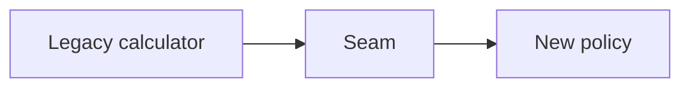

# Refactoring Safety

## Bối cảnh thuyết trình

**Legacy pricing migration** là case xuyên suốt. Giảng viên bắt đầu bằng code hoặc flow trực tiếp, cho học viên dự đoán failure rồi mới giới thiệu vocabulary/pattern.

## Kết quả học tập

- Characterization test
- Seam
- Small step
- Dual-run
- Rollback
- Giải thích trade-off và chọn baseline đơn giản hơn khi pattern chưa cần thiết.
- Trình bày test, metric hoặc artifact chứng minh thiết kế hoạt động.

## Luồng hệ thống

## Agenda 90 phút

| Phút | Hoạt động | Evidence tạo ra |
|---:|---|---|
| 0–8 | Phân tích Legacy pricing có nhánh ngầm và side effect k và chốt invariant | Một câu invariant có thể kiểm thử |
| 8–20 | Vẽ current flow và failure | Diagram có source of truth |
| 20–38 | Giải thích concept trọng tâm | behavior inventory, seam diagram và mismatch report |
| 38–58 | Live coding theo safety net | Commit nhỏ, demo vẫn chạy |
| 58–73 | Failure injection | Log/output chứng minh behavior |
| 73–84 | Pair review và alternative | Trade-off note |
| 84–90 | Trình bày 3 phút | Decision + evidence + next step |
## Live coding

**Failure dùng để dẫn bài:** Legacy pricing có nhánh ngầm và side effect khiến refactor đổi behavior ngoài ý muốn

1. Chọn ba scenario rủi ro để tạo characterization tests
2. Tạo seam quanh clock/provider/global state
3. Di chuyển một nhánh mà không đổi output
4. Chạy shadow comparison và ghi mismatch
## Tiêu chí hoàn thành

- [ ] Chọn ba scenario rủi ro để tạo characterization tests.
- [ ] Tạo seam quanh clock/provider/global state.
- [ ] Di chuyển một nhánh mà không đổi output.
- [ ] Nhóm bàn giao behavior inventory, seam diagram và mismatch report.
- [ ] Có câu trả lời cho trường hợp không áp dụng abstraction.
## Tài liệu lesson

- [Slides của bài Refactoring Safety](slides.md): mạch trình bày và sơ đồ dùng khi đứng lớp.
- [Speaker notes](speaker-notes.md): câu hỏi dẫn dắt, lỗi học viên và điểm cần nhấn mạnh cho Refactoring Safety.
- [Exercise](exercise.md): bài thực hành tạo evidence cho mục tiêu của lesson.
- [Quiz và đáp án](quiz.md): kiểm tra khả năng giải thích trade-off thay vì nhớ định nghĩa.
- Demo chạy được: `php demo.php` để quan sát luồng chính và failure case của Refactoring Safety.
